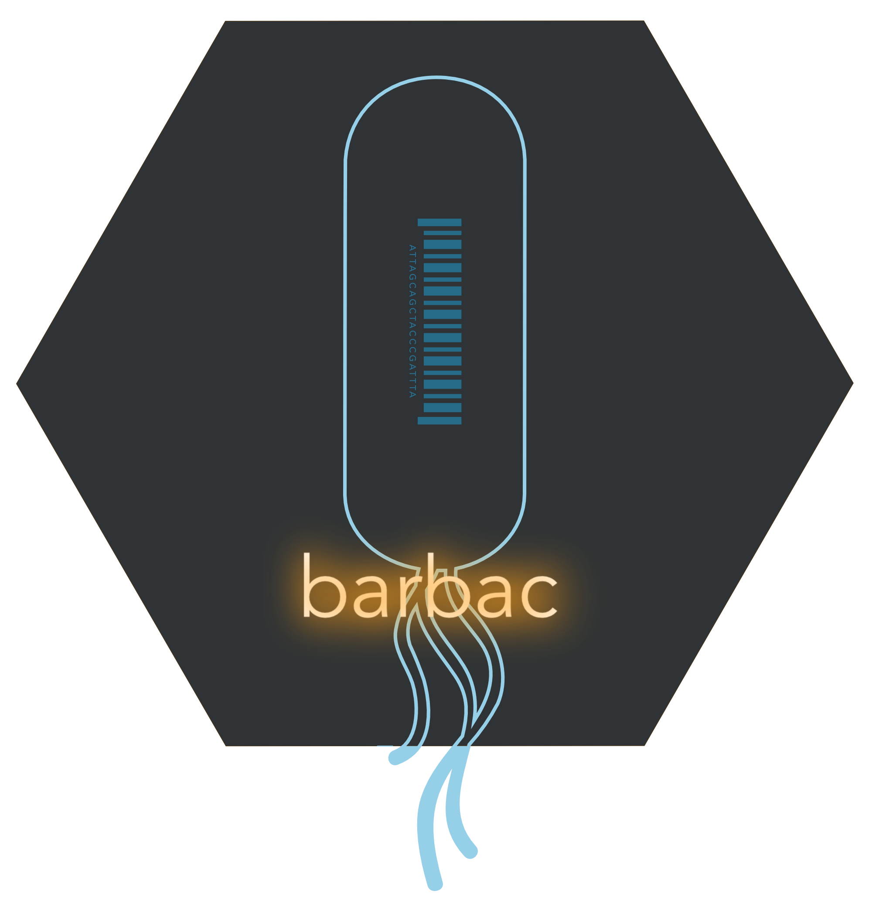

# barbac 

[](https://opensource.org/licenses/MIT)
[](https://cran.r-project.org/package=barbac)
[](https://codecov.io/gh/loukesio/barbac)



**barbac** (_**bar**code **b**ioinformatics **a**nalysis and **c**lustering_) is a comprehensive R package designed for researchers and bioinformaticians working with barcoded sequences. This lightweight wrapper integrates essential command-line bioinformatics tools into streamlined R workflows, making barcode analysis accessible and reproducible.

### Installation

```r
# Install development version from GitHub
if (!require("remotes")) install.packages("remotes")
remotes::install_github("loukesio/barbac")

# Load the package
library(barbac)
```

### Environment Setup

Before using barbac, configure the required bioinformatics tools:

```r
# Set up conda environment with all dependencies
barbac::configure_environment()

# Verify tool availability
barbac::check_barbac_tools()
```

This creates a conda environment (`barbac_env`) with:
- `fastqc` (v0.11.9+)
- `multiqc` (v1.12+)
- `pear` (v0.9.11+)
- `minimap2` (v2.24+)
- `samtools` (v1.15+)

---

## 📋 Input Requirements

### Sample Table Format

Your analysis starts with a sample table containing paired-end read information:

```r
sample_table <- data.frame(
  sample = c("sample1", "sample2", "sample3"),
  R1 = c("data/sample1_R1.fastq.gz", "data/sample2_R1.fastq.gz", "data/sample3_R1.fastq.gz"),
  R2 = c("data/sample1_R2.fastq.gz", "data/sample2_R2.fastq.gz", "data/sample3_R2.fastq.gz")
)
```

| sample  | R1                        | R2                        |
|---------|---------------------------|---------------------------|
| sample1 | data/sample1_R1.fastq.gz  | data/sample1_R2.fastq.gz  |
| sample2 | data/sample2_R1.fastq.gz  | data/sample2_R2.fastq.gz  |
| sample3 | data/sample3_R1.fastq.gz  | data/sample3_R2.fastq.gz  |

---

## 📖 Complete Workflow Example

### 1. Quality Control Assessment

```r
# Run FastQC on all samples
barbac::run_fastqc(
  sample_table = sample_table,
  output_dir = "results/fastQC",
  threads = 4
)

# Generate comprehensive MultiQC report
barbac::run_multiqc(
  input_dir = "results/fastQC",
  output_dir = "results/multiQC",
  report_name = "barcode_qc_report"
)
```

### 2. Paired-End Read Merging

```r
# Merge R1 and R2 reads using PEAR
barbac::run_pear_merge(
  sample_table = sample_table,
  output_dir = "results/merged",
  min_overlap = 10,
  max_assembly_length = 300,
  threads = 4
)
```

### 3. Reference Mapping

```r
# Map merged reads to barcode reference
barbac::run_minimap2(
  merged_dir = "results/merged",
  reference = "references/barcode_library.fasta",
  output_dir = "results/mapped",
  preset = "sr",  # short read preset
  threads = 8
)
```

### 4. BAM Processing and Statistics

```r
# Generate mapping statistics
stats_summary <- barbac::summarise_bam_stats(
  bam_dir = "results/mapped/bam",
  output_file = "results/mapping_summary.tsv"
)

# View summary
print(stats_summary)
```

---

## 🔍 Quality Control and Validation

### Tool Verification

```r
# Check if all required tools are available
tool_status <- barbac::check_barbac_tools()
print(tool_status)

# Validate conda environment
barbac::validate_environment()
```

### Pipeline Monitoring

```r
# Monitor pipeline progress
barbac::run_full_pipeline(
  sample_table = sample_table,
  reference = "references/barcode_library.fasta",
  output_dir = "results",
  verbose = TRUE,
  log_file = "pipeline.log"
)
```

---

## 📊 Output Structure

```
results/
├── fastQC/                 # FastQC reports
├── multiQC/               # MultiQC summary
├── merged/                # PEAR merged reads
│   ├── assembled/
│   ├── unassembled/
│   └── discarded/
├── mapped/                # Alignment results
│   ├── bam/              # BAM files
│   └── logs/             # Mapping logs
├── analysis/             # Downstream analysis
│   ├── clusters/
│   ├── trajectories/
│   └── diversity/
└── reports/              # Final reports
```

---

## 📚 Documentation and Support

### Function Reference

```r
# View package documentation
help(package = "barbac")

# Function-specific help
?barbac::run_fastqc
?barbac::cluster_barcodes
?barbac::calculate_trajectories
```

### Vignettes

```r
# Browse available vignettes
browseVignettes("barbac")

# Key tutorials
vignette("getting-started", package = "barbac")
vignette("advanced-analysis", package = "barbac")
vignette("time-series-analysis", package = "barbac")
```

---

## 🤝 Contributing

We welcome contributions! Please see our [Contributing Guide](CONTRIBUTING.md) for details.

### Development Setup

```r
# Clone the repository
git clone https://github.com/loukesio/barbac.git
cd barbac

# Install development dependencies
devtools::install_dev_deps()

# Run tests
devtools::test()

# Build documentation
devtools::document()
```

---

## 📄 Citation

If you use barbac in your research, please cite:

```
Author, A. et al. (2025). barbac: An R package for barcode-based bioinformatics 
workflows. Journal of Bioinformatics, XX(X), XXX-XXX.
```

---

## 🐛 Issues and Feature Requests

Found a bug or have a feature request? Please file an issue on our [GitHub Issues](https://github.com/loukesio/barbac/issues) page.

---

## 📝 License

This project is licensed under the MIT License - see the [LICENSE](LICENSE) file for details.

---

## 🙏 Acknowledgments

- The Bioconda community for maintaining bioinformatics tools
- Contributors to FastQC, MultiQC, PEAR, minimap2, and samtools
- The R community for continuous support and feedback

---

## 📞 Contact

**Maintainer**: [Your Name](mailto:your.email@institution.edu)  
**Institution**: [Your Institution]  
**Lab Website**: [Your Lab URL]

---

*For more information, tutorials, and examples, visit our [documentation website](https://loukesio.github.io/barbac/).*
