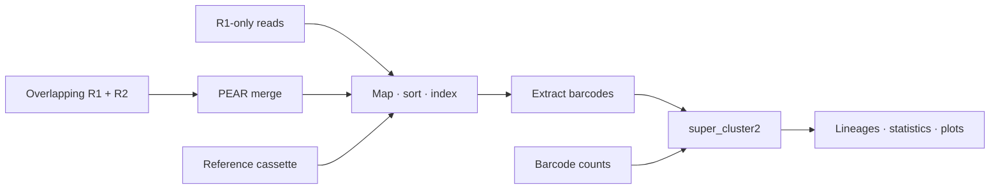
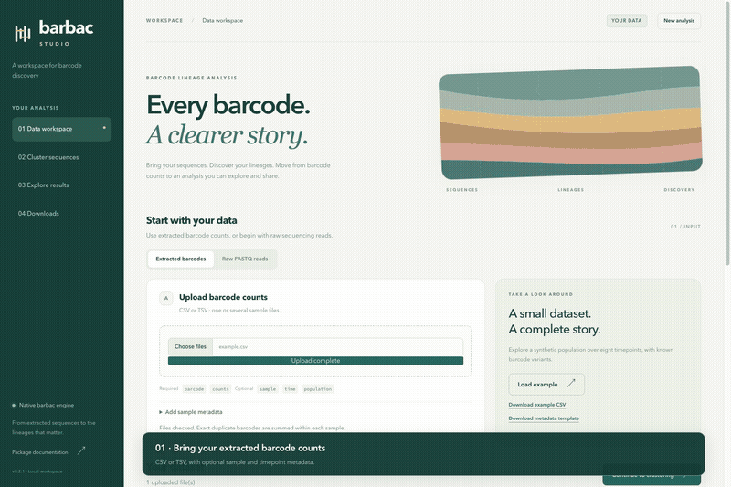

# barbac

[](https://github.com/loukesio/barbac/actions/workflows/R-CMD-check.yaml)
[](https://loukesio.github.io/barbac/)
[](LICENSE.md)
[](https://lifecycle.r-lib.org/articles/stages.html#experimental)


**Fast DNA barcode clustering. From sequencing reads to lineage trajectories.**

barbac is an R package for extracting DNA barcodes, correcting sequencing errors,
and following lineages through time. Its native C++ engine combines
abundance-aware clustering with Hamming or Levenshtein distances, retaining the
members and counts behind every inferred lineage.

Start with a barcode-count table or with **R1-only or overlapping paired-end
FASTQ reads**. Work in R, or explore your analysis in **barbac Studio**, the local
Shiny app.

[Get started](#quick-start) · [Explore Studio](#barbac-studio) ·
[Read the workflow](documentation/workflow.md) ·
[Inspect the evidence](documentation/validation.md)

<br clear="right">

## Quick start

Install from GitHub with a working C++ toolchain and the Bioconductor dependencies:

```r
install.packages(c("remotes", "BiocManager"))  # once, if missing
BiocManager::install(
  c("GenomicAlignments", "GenomicRanges", "Rsamtools", "Biostrings"),
  ask = FALSE, update = FALSE
)
remotes::install_github("loukesio/barbac", upgrade = "never")
library(barbac)
```

Cluster a CSV with `barcode,counts` columns, or pass a data frame directly:

```r
reads <- data.frame(
  barcode = c("ACGTACGTACGTACGTACGTACGTAC",
              "ACGTACGTACGTACGTACGTACGTAA",
              "TGCATGCATGCATGCATGCATGCATG"),
  counts = c(1000, 12, 800)
)

clusters <- super_cluster2(reads, method = "lv", distance = 3)
cluster_stats(clusters)
```

Each result row contains a `central_barcode`, its `all_barcodes` and `all_counts`,
and the combined `sum_counts`. Member sequences remain available for inspection
and for mapping the original samples back to a shared lineage identity.

## Built around the clustering

| Capability | What it gives you |
|---|---|
| **Native C++ search** | Bit-parallel distances, exact candidate partitions and abundance bounds that reduce unnecessary comparisons |
| **Hamming and Levenshtein** | Substitution-focused comparisons or edit distances that also handle insertions, deletions and shifts |
| **Explicit correction settings** | Distance and count-ratio guards, reproducible tie ordering, and an optional Poisson indel model |
| **Inspectable results** | Centroids, complete memberships, conserved counts and cluster diagnostics |
| **Lineages through time** | Shared memberships across samples and `barbac_ts_area()` plots with 32 built-in LTC palettes |

Use LV for indel-containing or variable-length libraries. Hamming is useful for
fixed-length substitution-focused designs. The Poisson model and support-based
tie ordering are explicit options; choose settings using your library design
and controls. See the [function reference](https://loukesio.github.io/barbac/reference/super_cluster2.html).

## From FASTQ to barcodes


```mermaid
flowchart LR
    R1["R1-only reads"] --> Map["Map · sort · index"]
    PE["Overlapping R1 + R2"] --> Merge["PEAR merge"] --> Map
    Ref["Reference cassette"] --> Map
    Map --> Extract["Extract barcodes"]
    Extract --> Cluster["super_cluster2"]
    Counts["Barcode counts"] --> Cluster
    Cluster --> Results["Lineages · statistics · plots"]
```

Set up the external tools once with `configure_environment()`, or use equivalent
tools already on your system. FastQC, minimap2 and samtools are required; PEAR is
needed for paired reads, and MultiQC is optional.

```r
configure_environment()  # needs an existing conda installation
use_barbac_env()

# R1-only reads map directly. Add R2 for overlapping paired reads.
samples <- data.frame(sample = "sample1", R1 = "data/sample1_R1.fastq.gz")
pipeline <- run_cli_pipeline(samples, "data/cassette.fasta", "results")

barcode_csv <- barbac_xtr(
  pipeline$bam_files[["sample1"]],
  ref_name = "my_cassette", start_pos = 171, end_pos = 196,
  output_file = "results/sample1_barcodes.csv"
)
clusters <- super_cluster2(barcode_csv)
```

Use your construct's reference name and **one-based, inclusive** coordinates.
For indel-preserving extraction, supply a `flank_pattern` whose capture group
matches the observed barcode between constant flanks. The
[complete workflow](documentation/workflow.md) explains both extraction modes,
QC, mixed single/paired sample tables and time-series joins.

## barbac Studio

A local workspace for the same native barbac engine. Upload extracted counts or
FASTQs, cluster your sequences, explore lineage plots and statistics, then
download the analysis.

[](app/media/studio-walkthrough.mp4)

| Watch the workflow | What you will see |
|---|---|
| [Barcode counts → complete analysis · 44 s](app/media/studio-walkthrough.mp4) | Upload, clustering, lineage plots, LTC palettes, memberships and exports |
| [FASTQ → extracted barcodes · 24 s](app/media/studio-fastq.mp4) | Paired-read extraction, downloading counts before clustering, and clustering |

These are actual app recordings using small synthetic examples. Their timings
illustrate the interface and are not benchmarks for large libraries.

From a repository checkout, launch Studio with:

```sh
git clone https://github.com/loukesio/barbac.git
cd barbac
Rscript app/run.R
```

Open **http://127.0.0.1:3838** on the same computer. The
[Studio guide](app/README.md) covers the additional R dependencies and optional
Quarto installation. Studio builds an isolated release installation of the
current package and runs locally; no public upload service is provided.

Download extracted counts **before clustering**, or export centroids, complete
memberships, per-sample lineage counts, clustering statistics, figures and a
self-contained Quarto HTML report. The [offline video viewer](app/media/watch.html)
plays both walkthroughs without R or Shiny.

## Plot every lineage

Pool counts within each independent population, cluster once, and map the
memberships back to each sample. Then plot the resulting long table:

```r
# lineage_counts: barcode, time, counts
barbac_ts_area(
  lineage_counts,
  min_total_count = 0,
  fill_missing = "zero",
  palette = "alger"
)
names(barbac_palettes())  # all 32 native LTC palettes
```

These explicit settings keep every lineage as its own band and missing counts
at zero. Pooling across timepoints is retrospective. See the
[time-series workflow](documentation/workflow.md#cluster-and-construct-a-time-series)
and [R vignette](https://loukesio.github.io/barbac/articles/barbac.html).

## Evidence and reproducibility

A barbac mode achieved the highest centroid F1 in **four of five datasets** in
the recorded comparison with Shepherd, Starcode and Bartender. Rankings depend
on the dataset, mode and metric. The [benchmark evidence](documentation/validation.md)
provides settings, complete tables, timings and limitations; the comparison's
v13 measurements remain separate from the current v14 search improvements.

The repository also includes reproducible workflows for the
[Chen 2023](benchmark/time_series_chen2023/README.md) and
[Jasinska 2020](benchmark/time_series_jasinska2020/README.md) applications,
known-truth extraction checks, and tests of indexed versus exhaustive clustering.
Raw study data and large generated analyses are recreated locally from the
provided scripts. [Verification instructions and receipts](documentation/validation.md)
explain exactly what was checked.

## Containers and help

The [container workflow](.github/workflows/docker.yml) builds the R package and
FASTQ toolchain for `linux/amd64`. Build the current release from a checkout:

```sh
docker build --platform linux/amd64 -t barbac:0.2.0 .
docker run --platform linux/amd64 --rm -it -v "$PWD":/data barbac:0.2.0 R
```

[Documentation](https://loukesio.github.io/barbac/) ·
[Issues](https://github.com/loukesio/barbac/issues) ·
[Source](https://github.com/loukesio/barbac)

Developed by Loukas Theodosiou. Use `citation("barbac")` for the package citation.
GPL (≥ 2); see [LICENSE.md](LICENSE.md). Bundled LTC palettes retain their
[attribution and permission notice](inst/COPYRIGHTS).
