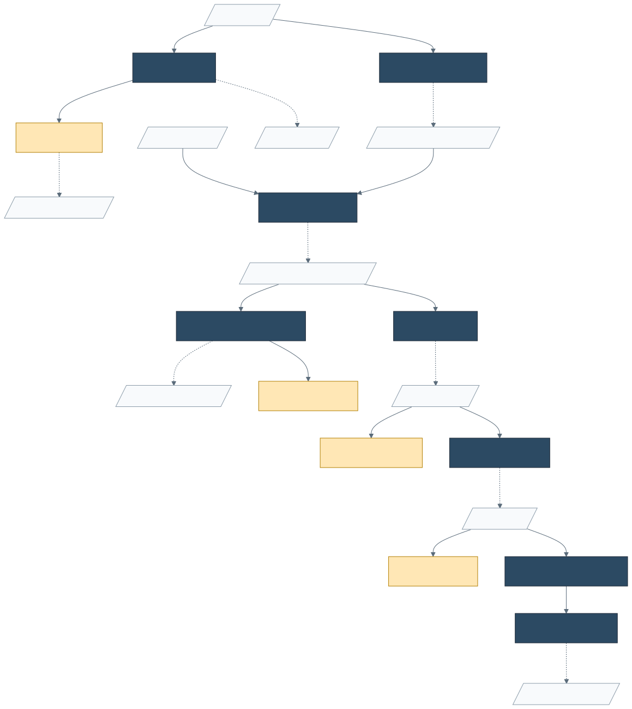

[](https://lifecycle.r-lib.org/articles/stages.html#experimental)
[-blue.svg)](https://www.gnu.org/licenses/gpl-2.0)
[](https://github.com/loukesio/barbac/actions/workflows/R-CMD-check.yaml)
[](https://github.com/loukesio/barbac/pkgs/container/barbac)
[](https://loukesio.github.io/barbac/)
[](https://github.com/loukesio/barbac/stargazers)

## Installation

**[barbac](https://loukesio.github.io/barbac/)** is an R package for end-to-end DNA barcode lineage tracking.


```r
# Install development version from GitHub
if (!require("remotes")) install.packages("remotes")
remotes::install_github("loukesio/barbac")

library(barbac)
```

`barbac` links to Rcpp and requires a working C++ toolchain. It also depends on the Bioconductor packages `GenomicAlignments` and `GenomicRanges` (installed automatically). The upstream CLI pipeline (FastQC, PEAR, minimap2, samtools) is optional and provisioned via `configure_environment()` on demand.

## Prefer a container? Use the pre-built image

Every push to `main` builds and publishes a Docker image with R,
Bioconductor, and the full FASTQ→BAM CLI stack (FastQC, PEAR,
minimap2, samtools, MultiQC) already installed, alongside the latest
`barbac`. Zero conda dance:

```bash
docker pull ghcr.io/loukesio/barbac:latest

# Start an R session with your working directory mounted at /data
docker run --rm -it -v "$(pwd)":/data ghcr.io/loukesio/barbac:latest R

# Or run a script non-interactively
docker run --rm -v "$(pwd)":/data ghcr.io/loukesio/barbac:latest \
  Rscript /data/my_analysis.R
```

Tags: `latest` on `main`, `<short-sha>` per commit, `0.1.0` /
`0.1` on version tags.

## Environment setup (optional — only for the FASTQ→BAM pipeline, native install)

```r
# One-time: create the conda environment with FastQC, PEAR, minimap2, samtools
configure_environment()

# Activate for this R session (adds the tools to PATH)
use_barbac_env()

# Sanity-check
check_barbac_tools()
```

---

## Quick start — clustering

```r
result <- super_cluster2(
  "path/to/reads.csv",   # or a data.frame with columns `barcode`, `counts`
  distance    = 3,       # max Levenshtein distance
  merge_ratio = 20       # distance-aware count-ratio merge guard
)

result
#> # A tibble: N x 5
#>   cluster_id central_barcode      all_barcodes all_counts sum_counts
#>   ...
```

`super_cluster2()` returns one row per cluster: the abundance-ranked centroid, the list of member barcodes and their counts, and the summed abundance.

## Quick start — time-series visualisation

```r
# Long-format input: (barcode, time, counts)
barbac_ts_area(reads_long,
               min_total_count = 10,
               include_late    = TRUE,   # keep barcodes appearing at later timepoints
               fill_missing    = "epsilon")

# Bartender-wide format is auto-detected
barbac_ts_area("path/to/cluster_output.csv")
```

Accepts either long-format or Bartender-wide input. If neither layout matches, `barbac_ts_area()` errors with the expected schema. Late-appearing lineages are carried through the full series with missing cells filled by ε (default `1e-6`) or by zero.

---

## The full FASTQ→lineage pipeline

<div align="center">



</div>

<sub>Diagram source: [`man/figures/pipeline.mmd`](man/figures/pipeline.mmd). To regenerate the SVG after editing, run <code>npx --yes -p @mermaid-js/mermaid-cli mmdc -i man/figures/pipeline.mmd -o man/figures/pipeline.svg -b transparent</code>.</sub>

### Define your samples

Provide a `samples.csv` file listing one sample per row. `sample` and `R1` are required; `R2` is optional (single-end mode is used when it's missing).

```r
sample_table <- data.frame(
  sample = c("sample1", "sample2", "sample3"),
  R1     = c("data/sample1_R1.fastq.gz", "data/sample2_R1.fastq.gz", "data/sample3_R1.fastq.gz"),
  R2     = c("data/sample1_R2.fastq.gz", "data/sample2_R2.fastq.gz", "data/sample3_R2.fastq.gz")
)
write.csv(sample_table, "samples.csv", row.names = FALSE)
```

| sample  | R1                        | R2                        |
|---------|---------------------------|---------------------------|
| sample1 | data/sample1_R1.fastq.gz  | data/sample1_R2.fastq.gz  |
| sample2 | data/sample2_R1.fastq.gz  | data/sample2_R2.fastq.gz  |
| sample3 | data/sample3_R1.fastq.gz  | data/sample3_R2.fastq.gz  |

### One-command pipeline

```r
run_cli_pipeline(
  sample_table = "samples.csv",
  reference    = "data/Reference_barcodes.fasta",
  output_dir   = "results",
  log_file     = "barbac.log"
)
```

### Step-by-step

<details>
<summary>Prefer to run each stage explicitly? Click to expand.</summary>

```r
samples <- "samples.csv"
ref     <- "data/Reference_barcodes.fasta"

# 1. Quality control
run_fastqc(samples)                            # -> results/fastQC/
run_multiqc()                                  # -> results/multiqc_report.html

# 2. Merge paired-end reads
run_pear_merge(samples)                        # -> results/merged/

# 3. Reference mapping
run_minimap2(merged_dir = "results/merged/",   # -> results/merged/bam/
             reference  = ref)

# 4. Mapping statistics (+ QC plot)
bam_stats <- summarise_bam_stats(bam_dir = "results/merged/bam/")
plot_bam_stats(bam_stats)                      # per-sample mapped/unmapped bars

# 5. Extract barcodes at fixed coordinates (+ QC plot)
barbac_xtr("results/merged/bam/sample1_sorted.bam",
           start_pos = 54, end_pos = 78)       # -> sample1_barcodes.csv
barbac_xtr.stats("sample1_barcodes.csv",
                 barcode_length = c(20, 30))   # histograms + summary table

# 6. Cluster (+ QC summary)
result <- super_cluster2("sample1_barcodes.csv", distance = 3)
cluster_stats(result)                          # n_clusters, singleton_frac, topK_frac

# 7. Visualise (once joined across timepoints)
barbac_ts_area(result_time_series)
```

</details>

### Output structure

```
results/
├── fastQC/                       # Quality control reports
│   ├── sample1_R1_fastqc.html
│   └── sample1_R2_fastqc.html
├── merged/                       # PEAR merged reads
│   ├── sample1_ANC.assembled.fastq   # "_ANC" tag added by run_pear_merge()
│   └── bam/                      # Alignment results
│       ├── *_sorted.bam
│       └── *_sorted.bam.bai
├── bam_summary.csv               # per-sample mapped / unmapped counts
└── pipeline.log
```

---

## Benchmarks

### Parity with Shepherd on the Johnson et al. (2023) reference dataset

Same input (100,000 true barcodes, ~1.5M unique reads), same parameters (max distance 3), same evaluation protocol.

| Method  | Pearson R | FN%  | FP%  | WS%  | Time    |
|---------|----------:|-----:|-----:|-----:|--------:|
| barbac  | 1.00      | 0.47 | 0.09 | 0.06 | **1.4 min** |
| Shepherd | 1.00     | 0.47 | 0.09 | 0.06 | 2.4 min |

470 of the 471 false negatives are shared between the two methods — both fail on the same hard cases (mostly barcodes with count = 0 in the input). See `benchmark/compare_with_shepherd.ipynb` for the full analysis.

### Robustness on Illumina-quality data

We benchmarked barbac against Shepherd, Starcode, and Bartender on 10,000-barcode / 1M-read datasets under Illumina-quality error regimes typical of experimental-evolution barcode sequencing: **0.5% per-base substitution rate**, insertion+deletion rates of **0% and 0.5%**. Higher indel rates typical of long-read platforms (PacBio, nanopore) are outside the scope of this comparison.

<!-- benchmark:unstructured:start -->
| Condition | Method | Pearson R | FN% | FP% | WS% | Wall (s) | Algo (s) |
|:--|:--|--:|--:|--:|--:|--:|--:|
| **sub_only** | barbac | 1.0000 | 0.54 | 0.58 | 0.54 | 6.93 | 3.38 |
|  | Shepherd | 1.0000 | 0.44 | 0.47 | 0.43 | 2.97 | 2.97 |
|  | Starcode | 1.0000 | 0.48 | 0.51 | 0.47 | 2.97 | 2.97 |
|  | Bartender | 1.0000 | 0.48 | 0.52 | 0.48 | 0.99 | 0.99 |
| **low_indel** | barbac | 1.0000 | 1.70 | 3.50 | 1.71 | 29.96 | 26.39 |
|  | Shepherd | 0.9993 | 0.95 | 49.15 | 48.81 | 3.58 | 3.58 |
|  | Starcode | 1.0000 | 1.58 | 3.38 | 1.59 | 17.95 | 17.95 |
|  | Bartender | 0.9959 | 0.94 | 511.14 | 509.41 | 3.19 | 3.19 |

*Median of three timed runs; generated from Git commit `082e7536fb5c6e356f72deb2d10fbe6d8ac071cd`.*
<!-- benchmark:unstructured:end -->

*Wall = end-to-end wall time. Algo = pure clustering time, excluding R boot + package loading for barbac (Shepherd/Starcode/Bartender pay a negligible boot tax so wall ≈ algo for them).*

**No-indel baseline.** All four methods preserve R = 1.0000, with FN/FP/WS differing by at most 11 barcodes out of 10,000. This confirms broad four-way agreement, while retaining the exact method-level differences.

**Realistic Illumina indel regime (0.5%).** Two-tier picture:

- **barbac and Starcode have similar clustering accuracy** — both preserve R = 1.0000 and confine WS below 1.8%. Starcode is slightly lower on FN, FP, and WS in this unstructured condition. Both use Levenshtein natively.
- **Shepherd and Bartender fragment strongly.** Shepherd's WS rises to 48.81% (about **29-fold** above barbac); Bartender's rises to **509.41% (about 298-fold above barbac)**. Both rely on Hamming-based indexing that fragments indel variants into spurious centroids.

**Trade-off against its Levenshtein peer (Starcode).**

- **Starcode is faster on this corrected low-indel benchmark** (17.95 s versus 26.39 s algorithm time). The correctness fix deliberately expands barbac's indel parent search; speed optimization of that safe search remains future work.
- **R-native**, with an in-package Rcpp binding — no shelling out to a standalone C binary and parsing text output.
- **Integrated with the FASTQ→lineage pipeline** (`run_cli_pipeline`, `barbac_xtr`) and the time-series visualisation (`barbac_ts_area`) in the same package.

### Structured (mixed-anchor) barcode designs

Many real barcode libraries are not fully random: they interleave random
positions with fixed anchor sequences (e.g. `NNNNNNNN-ATGC-NNNNNNNN-ATCGTTAA`).
We benchmarked this case with a 28 bp template carrying 16 variable positions,
2,000 barcodes and 200k reads, clustered at distance 3. The fixed anchors are
the interesting stress: indels shift them out of register, which fragments
Hamming-indexed methods. The variable region is deliberately wide enough that
only 28 of 2,000 true barcodes fall within distance 3 of another, so the numbers
reflect the tools, not the design.

<!-- benchmark:structured:start -->
**sub_only (0% indel — representative of Illumina):**

| Method | Pearson R | FN% | FP% | WS% |
|:--|--:|--:|--:|--:|
| barbac | 1.0000 | 0.55 | 0.55 | 0.50 |
| Shepherd | 1.0000 | 0.75 | 0.75 | 0.70 |
| Starcode | 1.0000 | 1.35 | 1.25 | 1.20 |
| Bartender | 1.0000 | 0.65 | 0.75 | 0.70 |

**low_indel (0.5% ins, 0.5% del):**

| Method | Pearson R | FN% | FP% | WS% |
|:--|--:|--:|--:|--:|
| barbac | 1.0000 | 2.25 | 9.15 | 2.50 |
| Shepherd | 0.9989 | 1.70 | 101.30 | 100.35 |
| Starcode | 1.0000 | 3.15 | 10.10 | 3.45 |
| Bartender | 0.9944 | 1.45 | 772.55 | 765.75 |
<!-- benchmark:structured:end -->

- **barbac has the lowest wrong-sequence rate of all four tools on both
  conditions** — the anchors don't trip it up because the Levenshtein kernel
  realigns indel-shifted reads.
- **Shepherd and Bartender fragment on indels**, WS jumping to 100% and 766% as
  soon as indels appear, because Hamming-based indexing splits each
  anchor-shifted variant into its own centroid.
- **Starcode is barbac's closest competitor** (also Levenshtein-based), but
  barbac edges it on every metric here.
- FP at nonzero indel rates is inflated for every tool by harmless singleton
  error-reads that drift more than 3 edits from any true barcode; **WS**
  (spurious centroids *near* a true barcode) is the metric that separates safe
  tools from fragmenting ones.

Full reproducibility scripts are in [`benchmark/indel_experiment/`](benchmark/indel_experiment/). Publication runs refuse a dirty checkout and record the exact Git commit, compiled clustering build ID, input hashes, parameters, platform, and tool versions. The README tables are updated from those recorded CSV files with `update_readme.py`, rather than copied by hand. The experiment runner also produces mid- and high-indel conditions; those regimes (2%+ indels) are outside the Illumina scope of the current paper and treated as future work.

---

## Documentation

- 📖 **Package website:** <https://loukesio.github.io/barbac/>
- 📘 **Getting-started vignette:** `vignette("barbac", package = "barbac")` or `browseVignettes("barbac")`
- 💻 **Function help:** `?super_cluster2`, `?barbac_ts_area`, `?run_cli_pipeline`, `?barbac_xtr`, `?configure_environment`

## Support

<table>
  <tr>
    <td>🐛 <b>Issues</b></td>
    <td><a href="https://github.com/loukesio/barbac/issues">Report a bug or problem</a></td>
  </tr>
  <tr>
    <td>💡 <b>Discussions</b></td>
    <td><a href="https://github.com/loukesio/barbac/discussions">Feature requests & questions</a></td>
  </tr>
  <tr>
    <td>📧 <b>Email</b></td>
    <td><a href="mailto:loukesio@gmail.com">loukesio@gmail.com</a></td>
  </tr>
  <tr>
    <td>🦋 <b>Bluesky</b></td>
    <td><a href="https://bsky.app/profile/bioinformatician.bsky.social">@bioinformatician.bsky.social</a></td>
  </tr>
</table>


## License

GPL (≥ 2). See [LICENSE.md](LICENSE.md).
