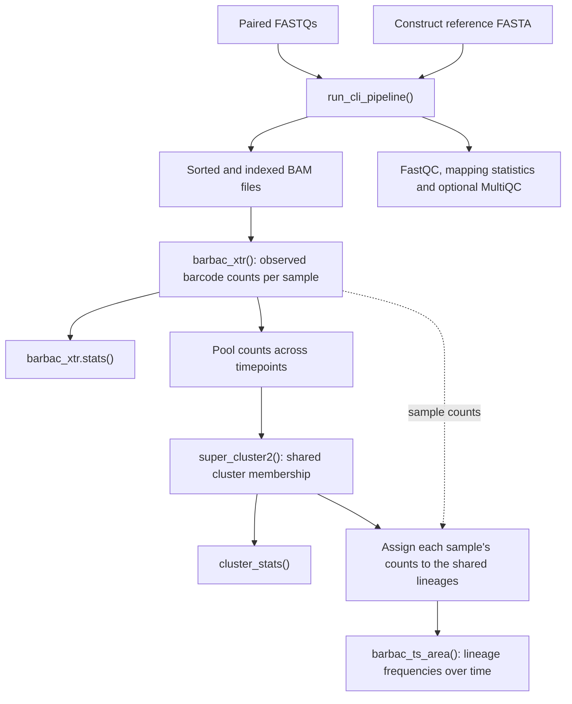

# barbac

[](https://lifecycle.r-lib.org/articles/stages.html#experimental)
[-blue.svg)](LICENSE.md)
[](https://github.com/loukesio/barbac/actions/workflows/R-CMD-check.yaml)


**barbac is an R package for DNA barcode extraction, error correction and
lineage tracking.** It provides FASTQ preprocessing and reference mapping,
barcode extraction from BAM files, native C++ Hamming/Levenshtein clustering,
R diagnostics and time-series plots with all 32 LTC palettes built in.

This README describes **`feat/exact-search-clustering`**. Install this branch
explicitly to get its extraction options, LV improvements and native palettes.
The website, `main` CI badge and published `latest` Docker image follow `main`.

## Verification of this branch

The [reproducible integration check](benchmark/validation/verify_pipeline_extraction.R)
uses real FastQC, PEAR, minimap2, samtools and MultiQC executables, followed by
`barbac_xtr()`, clustering and R plots. It generates its own reads with known
barcode identities and counts; it does not download a sequencing dataset.
The dated [verification receipt](benchmark/validation/pipeline_extraction/validation.json)
records the checked R/C++ source hashes, tool versions, test results and output hashes.
The latest run passed on **10 September 2026**, using **R 4.5.1 on macOS arm64**.

| Check | Verified result |
|---|---|
| FASTQ input and merging | 4 FASTQs, 2 samples, 290 pairs; 290 merged reads |
| Mapping and QC | 285 mapped reads and 5 deliberately unrelated unmapped reads; FastQC totals reconcile and MultiQC renders |
| Fixed-coordinate extraction | All 140 reads in the substitution-free sample have the exact expected barcode and count |
| Flank extraction | All 285 mapped reads have the expected barcode and read ID; observed 25-, 26- and 27-base sequences retain the designed indels |
| LV clustering and time series | 3 expected centroids; all 285 extracted reads conserved; all 6 lineage/timepoint counts match the known truth |
| R diagnostics and plotting | Extraction panels, mapping plot and `palette = "alger"` area plot render; frequencies sum to 1 at each timepoint |
| Package tests | 40 test cases, 488 passing assertions, 0 failures/errors/skips/test warnings |

Inspect the [barcode counts](benchmark/validation/pipeline_extraction/barcode_counts.csv),
[lineage counts](benchmark/validation/pipeline_extraction/lineage_counts.csv),
[extraction diagnostics](benchmark/validation/pipeline_extraction/extraction_diagnostics.pdf)
and [time-series plot](benchmark/validation/pipeline_extraction/barcode_time_series.pdf).
This is a small integration check on the recorded local environment. The
larger studies and accuracy benchmarks below provide separate evidence for
performance on experimental and simulated data. Docker and cluster execution
are not established by the local integration check.

## Installation

A working C++ toolchain and R/Bioconductor dependencies are required.

```r
install.packages(c("remotes", "BiocManager"))  # once, if missing
BiocManager::install(
  c("GenomicAlignments", "GenomicRanges", "Rsamtools", "Biostrings"),
  ask = FALSE, update = FALSE
)
remotes::install_github(
  "loukesio/barbac", ref = "feat/exact-search-clustering",
  upgrade = "never"
)
library(barbac)
```

For development from an existing checkout:

```r
devtools::load_all(".")
```

`load_all()` may compile with debug optimization flags. Use an installed
release build for performance measurements; see the
[release-build instructions](benchmark/time_series_jasinska2020/README.md).

### External tools for FASTQ preprocessing

Clustering, extraction from an indexed BAM and plotting use R package dependencies.
FASTQ preprocessing needs FastQC, PEAR, minimap2 and samtools; MultiQC is optional
in `run_cli_pipeline()` and required by the complete verification script.

```r
configure_environment()  # one-time conda setup; reuses an existing barbac_env
use_barbac_env()         # activate its tools for this R session
check_barbac_tools()     # availability, versions and executable paths
```

Conda must already be installed for `configure_environment()`. On a cluster,
load equivalent tools with modules or activate the existing environment; a second
barbac-specific environment is unnecessary. Fixed-coordinate extraction invokes
samtools if the BAM index is missing, so indexing the BAM beforehand is preferred.

## FASTQ → BAM → barcodes


```mermaid
flowchart TD
    reads[Paired FASTQs] --> pipeline["run_cli_pipeline()"]
    reference[Construct reference FASTA] --> pipeline
    pipeline --> bam[Sorted and indexed BAM files]
    pipeline --> qc[FastQC, mapping statistics and optional MultiQC]
    bam --> extract["barbac_xtr(): observed barcode counts per sample"]
    extract --> diagnostics["barbac_xtr.stats()"]
    extract --> pool[Pool counts across timepoints]
    pool --> cluster["super_cluster2(): shared cluster membership"]
    cluster --> summary["cluster_stats()"]
    cluster --> join[Assign each sample's counts to the shared lineages]
    extract -. sample counts .-> join
    join --> area["barbac_ts_area(): lineage frequencies over time"]
```

`run_cli_pipeline()` performs **FastQC → PEAR → minimap2/samtools → BAM statistics**,
plus MultiQC when available. Call `barbac_xtr()` and the downstream R functions
explicitly after that. The wrapper does not automatically extract barcodes,
cluster them or assemble a time series.

### 1. Prepare paired reads and the mapping reference

Use one sample per row, with unique sample names and matching `R1`/`R2` paths:

```r
samples <- data.frame(
  sample = c("sample1", "sample2"),
  R1 = c("data/sample1_R1.fastq.gz", "data/sample2_R1.fastq.gz"),
  R2 = c("data/sample1_R2.fastq.gz", "data/sample2_R2.fastq.gz")
)
write.csv(samples, "samples.csv", row.names = FALSE)
```

The current wrapper maps PEAR-assembled FASTQs. Use it for overlapping paired
reads. Omitting `R2` skips PEAR and does **not** provide a complete single-end
mapping workflow. For single-end reads and construct-specific mapping options,
use an explicit mapping script such as the
[validated E. coli workflow](benchmark/time_series_jasinska2020/process_samples.R).
Keep each analysis in a fresh output directory: the wrapper discovers assembled
files in that directory, including files left by earlier runs.

The reference FASTA must describe your sequenced construct with enough constant
flanking sequence for alignment. A barcode-cassette reference is appropriate for
the studies here. `ref_name` must exactly match its FASTA record name/BAM target.
Choose coordinates and flank patterns from that construct, rather than copying
another study's barcode positions.

### 2. Run preprocessing and mapping

```r
pipeline <- run_cli_pipeline(
  sample_table = "samples.csv",    # a data.frame also works
  reference = "data/cassette.fasta",
  output_dir = "results"
)
pipeline$stats
plot_bam_stats(pipeline$stats)
```

The returned list includes `bam_dir`, `stats`, `summary_file`, `log_file`,
`fastqc_dir`, `merged_dir`, `output_dir` and the executed `commands`.
The wrapper logs command failures and does not stop on every external-tool error;
check the log, expected files and read counts before continuing.

```text
results/
├── fastQC/                              # FastQC HTML and ZIP files
├── merged/
│   ├── sample1_ANC.assembled.fastq
│   └── bam/
│       ├── sample1_ANC.assembled_sorted.bam
│       └── sample1_ANC.assembled_sorted.bam.bai
├── multiqc/multiqc_report.html          # when MultiQC is available
├── bam_summary.csv
└── pipeline.log
```

`run_fastqc()`, `run_multiqc()`, `run_pear_merge()`, `run_minimap2()` and
`summarise_bam_stats()` are also available for explicit stage-by-stage execution.
See their help for paths and arguments; their default directories are not all
identical to the wrapper's defaults.

### 3. Extract barcodes with `barbac_xtr()`

The two modes serve different extraction designs. Coordinates are **one-based,
inclusive**. This example uses the verification fixture's reference name and
26-base locus; replace them for your own construct.

```r
bam <- file.path(pipeline$bam_dir, "sample1_ANC.assembled_sorted.bam")
barcode_csv <- barbac_xtr(
  bam_file = bam,
  ref_name = "verification_cassette",
  start_pos = 171, end_pos = 196,
  output_file = "results/sample1_barcodes.csv",
  min_count = 1
)
counts <- readr::read_csv(barcode_csv, show_col_types = FALSE)
```

**Fixed-coordinate mode** projects the reads onto the requested reference
interval. It returns fixed-width strings and can contain alignment gap/padding
characters; it is not the mode for preserving variable-length indel barcodes.
The function returns the CSV path, not a count table. Count-mode CSV columns are
`barcode`, `counts` and `barcode_length`. If `output_file` is omitted, the output
is beside the BAM; for the filename above it ends in `_sorted_barcodes.csv`.

**Flank mode** matches a capture group in the observed BAM query sequence:

```r
barcode_csv <- barbac_xtr(
  bam_file = bam,
  ref_name = "verification_cassette",
  start_pos = 171, end_pos = 196,
  flank_pattern = "AGTGAGACCTGA([ACGT]{24,28})ATTTCGGGTTCC",
  output_file = "results/sample1_flanked_barcodes.csv",
  min_count = 1
)
```

Here the constant flanks identify the barcode boundaries and the capture group
retains observed sequences of 24–28 bases. In this mode, coordinates select a
reference locus that the alignment must span with a base on each side; the
capture group determines the extracted sequence. Unmapped, secondary and
supplementary alignments are excluded, as are alignments with hard clipping or
skipped reference regions. Matching uses reference-oriented query sequences.
`reverse_complement = TRUE` changes the orientation before matching;
`read_window` restricts the query search window after that operation.

Use `include_read_ids = TRUE` to obtain `read_id`, `barcode`, `barcode_length`
rows for downstream read-level joins instead of aggregated counts. This requires
`min_count = 1`. Read names can repeat between mates in paired BAMs; preserve mate
identity in those joins. Extraction does not perform UMI deduplication.

For the E. coli study, the actual
[288-base cassette](benchmark/time_series_jasinska2020/reference/cassette.fasta)
has a nominal **15-base** barcode masked at positions **11–25**. Its workflow
uses the downstream alignment anchor at **32–40** with
`flank_pattern = "^([ACGT]{10,20})TATCTCGGTAG"` and
`ref_name = "Jasinska2020_barcode_cassette"`. Those anchor coordinates do not
imply a nine-base barcode. See the
[extraction design and reference](benchmark/time_series_jasinska2020/README.md#reference-and-extraction).

### 4. Inspect extraction diagnostics

```r
diagnostics <- barbac_xtr.stats(
  barcode_csv, barcode_length = c(24, 28),
  panel_labels = TRUE, return_details = TRUE
)
diagnostics$plot           # length, abundance and sequence-entropy panels
diagnostics$length_summary # numeric table, usable with gt::gt()
```

`return_details = FALSE` (the default) returns the combined patchwork plot.
The length summary distinguishes unique-sequence counts from read counts.
Sequence entropy measures nucleotide diversity *within a barcode*, in bits;
it is different from abundance-based Shannon diversity across lineages.

## Cluster and construct a time series

```r
clusters <- super_cluster2(
  barcode_csv,
  method = "lv", distance = 3,
  tie_break = "support", merge_ratio = 20,
  error_rate = 0.005, indel_model = "poisson"
)
cluster_stats(clusters)
```

The result contains `cluster_id`, `central_barcode`, list columns `all_barcodes`
and `all_counts`, and `sum_counts`. `distance` is the maximum allowed edit
distance. `error_rate` is a separate model parameter used in merging decisions.
`tie_break = "support"` uses one-edit neighbour counts when abundances tie;
the default is `"sequence"`. The Poisson indel model is opt-in. Set these options
for your library and controls; the example parameters are not universal optima.
Use `method = "hamming"` for fixed-length, substitution-only comparisons;
LV also handles insertions, deletions and positional shifts.

For a time series, pool barcode counts across the chosen samples, cluster that
pool once, then map each sample's counts through the resulting membership table.
This gives a consistent lineage identity across timepoints. The integration
script demonstrates the full join and checks every resulting count. Retrospective
pooling uses information from all included timepoints.

```r
# reads_long has one row per barcode/time, with columns barcode, time, counts
barbac_ts_area(
  reads_long, min_total_count = 0, fill_missing = "zero",
  palette = "alger"
)
names(barbac_palettes())             # all 32 built-in LTC palette names
barbac_palette("casa_natal", n = 100) # a colour vector for other plots
```

With `min_total_count = 0` and `fill_missing = "zero"`, every lineage receives
its own band and missing counts stay zero. Frequencies divide by the retained
barcode counts at each timepoint. The defaults are a count threshold of 10 and
an epsilon fill; select these explicitly when interpreting frequencies.
Bartender-wide tables with `Cluster.ID` and `time_point_*` columns are also accepted.

Named palettes are interpolated across barcodes. Custom colour vectors and the
Sailboat default remain available. For matching colours across populations,
build one mapping over the union of barcode IDs and pass the appropriate subset
to each plot; see the [paired palette examples](benchmark/time_series_jasinska2020/r_report/palette_comparison.qmd).
Use `interactive = "ggiraph"` or `"plotly"` with the corresponding optional package
installed. The experimental report uses static R images for its very dense area
plots and interactive tables/other charts.

## Larger applications and accuracy benchmarks

The [Chen 2023 application](benchmark/time_series_chen2023/results/README.md)
processed 16,511,755 input pairs and retained 16,051,344 molecules after its
study-specific extraction and UMI filtering. The
[verification record](benchmark/time_series_chen2023/results/validation.json)
checks input files, counts and normalization. Its
[workflow and SLURM instructions](benchmark/time_series_chen2023/README.md)
and [R/Quarto report instructions](benchmark/time_series_chen2023/r_report/README.md)
are available.

The [Jasinska 2020 application](benchmark/time_series_jasinska2020/README.md)
processed 312 FASTQs containing 364,267,911 unique input reads, including the
shared initial samples. The [processing verification](benchmark/time_series_jasinska2020/results/processing_validation.json)
reconciles all 78 sample receipts and FastQC totals. Its
[biological report source](benchmark/time_series_jasinska2020/r_report/report.qmd)
compares three chloramphenicol-treated populations with three controls.
These archived analyses retain their original source/build hashes and timings;
they are distinct from the current branch integration check. Agreement with
published counts measures agreement with that processing reference, not known-truth accuracy.

The [paper comparison](benchmark/latest_four_conditions/README.md) compares both
barbac modes with Shepherd, Starcode and Bartender on four simulated conditions
and the Milos/Johnson reference. These are **recorded v13 measurements**.
Native v14 preserves assignments in its recorded validation while improving LV
candidate search; no v14 timing is substituted into the v13 table.

Each cell below is **centroid F1 (%) / workflow time (seconds)**. F1 measures
recovery of true centroid identities: precision = TP/(TP+FP), recall = TP/(TP+FN),
and F1 is their harmonic mean. FP counts extra centroids; FN counts missed true
centroids. F1 is not the percentage of individual reads assigned correctly.
Accuracy averages three seeds in each smaller simulation; each workflow timing
is one serial observation. Milos uses one fixed input. R-S/R-I are random designs
with substitutions only/with indels; A-S/A-I are the corresponding anchored designs.

| Method | R-S | R-I | A-S | A-I | Milos |
|---|---:|---:|---:|---:|---:|
| barbac Hamming | 99.538 / 4.98 | 26.326 / 4.78 | 99.249 / 4.05 | 19.410 / 5.77 | 99.72147 / 20.81 |
| barbac LV + Poisson | 99.538 / 4.14 | 97.736 / 5.96 | 99.244 / 4.63 | 94.801 / 8.50 | 99.72246 / 43.40 |
| Shepherd | 99.502 / 3.47 | 79.648 / 3.74 | 99.162 / 117.94 | 65.188 / 105.08 | 99.72196 / 110.95 |
| Starcode sphere | 99.475 / 2.94 | 97.456 / 17.52 | 97.039 / 4.44 | 91.962 / 26.24 | 99.43682 / 155.30 |
| Starcode MP | 97.767 / 3.12 | 91.044 / 18.84 | 96.251 / 5.32 | 84.837 / 26.51 | 99.45408 / 150.22 |
| Bartender | 99.547 / 1.57 | 27.916 / 3.05 | 98.832 / 2.17 | 20.153 / 7.90 | 99.39120 / 36.52 |

A barbac mode has the highest reported F1 in three of four simulated conditions:
LV leads both indel conditions and Hamming leads A-S. LV also leads on Milos;
Bartender narrowly leads R-S. Speed rankings vary by dataset.
The [complete tables](benchmark/latest_four_conditions/paper_table.md) include
FN, FP and assignment metrics, with the
[dataset schematic](manuscript/media/benchmark_datasets.png) and recorded settings.
Earlier experiments remain in [the reference comparison](benchmark/reference_comparison/README.md),
[the indel experiments](benchmark/indel_experiment/) and
[the LV optimization notes](benchmark/lv_optimization/README.md).

## Re-run verification

The repository contains code, reference sequences, compact summaries and small
verification artifacts. Raw sequencing files, full barcode-count matrices,
rendered HTML reports and their large plot assets are generated locally and
excluded from version control. Follow each study's scripts to recreate them;
paths inside report sources refer to those local outputs.

From a checkout of this branch, with the existing `barbac_env` available:

```bash
Rscript benchmark/validation/verify_pipeline_extraction.R
```

The script needs `pkgload`, `testthat`, `jsonlite` and `digest` in addition to
barbac's dependencies. It runs the real paired-read pipeline, both extraction
modes, read-ID checks, clustering, plotting and the full package test suite.
It writes the receipt and small CSV/PDF artifacts under
`benchmark/validation/pipeline_extraction/`; temporary synthetic FASTQs and BAMs
are removed. A failed assertion exits with an error and writes a failed receipt.

For the package tests alone:

```r
devtools::load_all(".")
testthat::test_dir("tests/testthat", reporter = "summary")
```

## Containers and documentation

The [Docker workflow](.github/workflows/docker.yml) builds the `main` image at
`ghcr.io/loukesio/barbac:latest`. To include this branch, build its checkout:

```bash
docker build -t barbac:branch .
docker run --rm -it -v "$PWD":/data barbac:branch R
```

Container builds are separate from the local verification above.

- [R vignette source for this branch](vignettes/barbac.Rmd)
- [Package website](https://loukesio.github.io/barbac/) — follows `main`
- Function help: `?run_cli_pipeline`, `?barbac_xtr`, `?barbac_xtr.stats`, `?super_cluster2`, `?barbac_ts_area`
- [Issues](https://github.com/loukesio/barbac/issues) and [discussions](https://github.com/loukesio/barbac/discussions)

GPL (≥ 2). See [LICENSE.md](LICENSE.md). Bundled LTC colour data retain their
[attribution and permission notice](inst/COPYRIGHTS).
