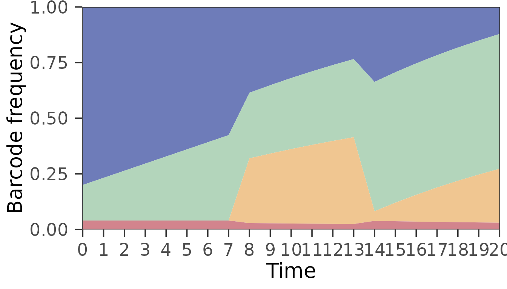
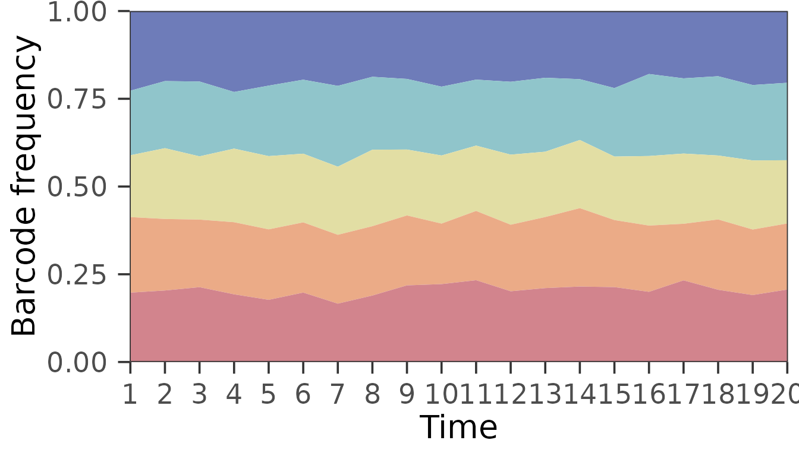
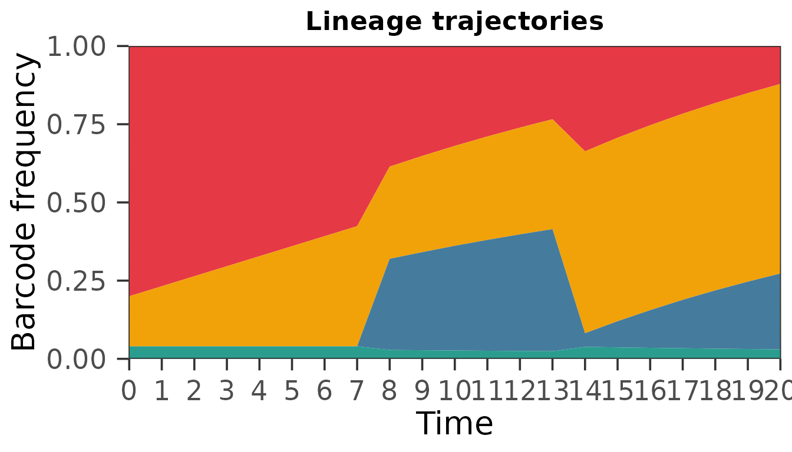
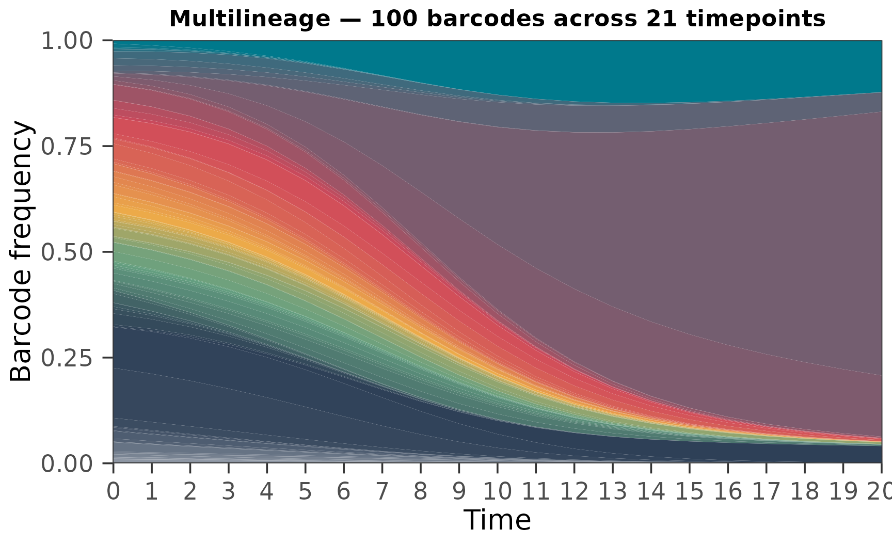

# Introduction to barbac


**barbac** is an R package for end-to-end DNA barcode lineage tracking.
This vignette walks through the core R-level workflow — clustering a
count table with
[`super_cluster2()`](https://loukesio.github.io/barbac/reference/super_cluster2.md)
and visualising a time series with
[`barbac_ts_area()`](https://loukesio.github.io/barbac/reference/barbac_ts_area.md)
— without requiring any external CLI tools. For the full FASTQ→BAM
pipeline (FastQC → PEAR → minimap2 → samtools), see
[`?run_cli_pipeline`](https://loukesio.github.io/barbac/reference/run_cli_pipeline.md).

``` r

library(barbac)
library(tibble)
library(dplyr)
```

## A tiny synthetic dataset

We build a toy dataset of 4 true barcodes, each seeded from a
20-nucleotide random sequence, with 100 noisy reads per barcode. Each
read has a per-base substitution probability of 1%.

``` r

alphabet <- c("A", "C", "G", "T")

random_barcode <- function(len = 20) {
  paste0(sample(alphabet, len, replace = TRUE), collapse = "")
}

mutate_seq <- function(seq, sub_rate = 0.01) {
  bases <- strsplit(seq, "")[[1]]
  hit   <- runif(length(bases)) < sub_rate
  bases[hit] <- vapply(bases[hit], function(b) {
    sample(setdiff(alphabet, b), 1L)
  }, character(1))
  paste0(bases, collapse = "")
}

true_barcodes <- vapply(1:4, function(i) random_barcode(), character(1))
true_barcodes
#> [1] "ATGACAGGCCGGAAACCCCG" "AGAAAACAACCCATGATGCC" "CCGTTTCTAGCATTAGTCCG"
#> [4] "GCCTTCCACCCCAGGTCGGT"

reads <- unlist(lapply(true_barcodes, function(b) {
  replicate(100, mutate_seq(b, sub_rate = 0.01))
}))

# Collapse to unique-sequence counts
input <- as.data.frame(table(reads), stringsAsFactors = FALSE)
names(input) <- c("barcode", "counts")
input <- input[order(-input$counts), ]
head(input)
#>                 barcode counts
#> 49 CCGTTTCTAGCATTAGTCCG     81
#> 5  AGAAAACAACCCATGATGCC     80
#> 21 ATGACAGGCCGGAAACCCCG     78
#> 61 GCCTTCCACCCCAGGTCGGT     77
#> 19 ATAACAGGCCGGAAACCCCG      3
#> 43 CCGTTTCAAGCATTAGTCCG      3
```

## Clustering with `super_cluster2()`

[`super_cluster2()`](https://loukesio.github.io/barbac/reference/super_cluster2.md)
accepts either a data.frame with columns `barcode` and `counts`, or a
path to a CSV in the same layout. Here we pass the data.frame directly
and use a Levenshtein distance threshold of 2.

``` r

result <- super_cluster2(
  input,
  distance    = 2,
  merge_ratio = 20,
  verbose     = FALSE
)
result
#> # A tibble: 4 × 5
#>   cluster_id central_barcode      all_barcodes all_counts sum_counts
#>   <chr>      <chr>                <list>       <list>          <int>
#> 1 group1     CCGTTTCTAGCATTAGTCCG <chr [18]>   <int [18]>        100
#> 2 group2     AGAAAACAACCCATGATGCC <chr [18]>   <int [18]>        100
#> 3 group3     ATGACAGGCCGGAAACCCCG <chr [18]>   <int [18]>        100
#> 4 group4     GCCTTCCACCCCAGGTCGGT <chr [22]>   <int [22]>        100
```

Each row is one cluster: `central_barcode` is the abundance-ranked
representative, `all_barcodes` and `all_counts` are the member barcodes
and their raw counts, and `sum_counts` is the summed abundance.

We can check how well the clustering recovered the true barcodes:

``` r

recovered <- result$central_barcode
sum(true_barcodes %in% recovered)     # how many true barcodes are centroids
#> [1] 4
setdiff(true_barcodes, recovered)     # any missed
#> character(0)
```

## Visualising a time series

[`barbac_ts_area()`](https://loukesio.github.io/barbac/reference/barbac_ts_area.md)
takes a table of counts across timepoints and returns a stacked-area
ggplot of per-timepoint frequencies. It accepts long-format input
directly:

``` r

tp   <- 0:20                                            # 21 timepoints
n_tp <- length(tp)

ts_long <- dplyr::bind_rows(
  tibble(barcode = "A", time = tp,
         counts = round(seq(1000, 200, length.out = n_tp))),    # falling
  tibble(barcode = "B", time = tp,
         counts = round(seq( 200, 1000, length.out = n_tp))),   # rising
  tibble(barcode = "C", time = tp,
         counts = ifelse(tp < 8, 0,
                         round(seq(0, 800, length.out = n_tp - 7 + 1))[-1])), # late arrival
  tibble(barcode = "D", time = tp, counts = 50)                 # constant
)

barbac_ts_area(ts_long, min_total_count = 0)
```



Lineage C illustrates the “late arrivals” case: it has zero counts at
timepoints 0–7, but is carried through the full series because
`include_late = TRUE` (the default) and missing cells are filled with a
small ε.

The same function auto-detects Bartender’s wide export layout:

``` r

set.seed(11)

ts_wide <- cbind(
  tibble(
    Cluster.ID    = sprintf("bc%02d", 1:5),
    Center        = c("ACGT", "ACGA", "ACCA", "TGGT", "GACC"),
    Cluster.Score = round(runif(5, 0.7, 1), 2)
  ),
  setNames(
    as.data.frame(matrix(rpois(5 * 20, 100), nrow = 5)),
    sprintf("time_point_%d", 1:20)
  )
)

barbac_ts_area(ts_wide, min_total_count = 0)
```



If the layout is neither long nor Bartender-wide, the function stops
with a clear error that lists the expected column names.

## Styling — `theme_barbac()` is applied by default

[`barbac_ts_area()`](https://loukesio.github.io/barbac/reference/barbac_ts_area.md)
returns a `ggplot` object that has already been styled with the
package’s publication-ready theme,
[`theme_barbac()`](https://loukesio.github.io/barbac/reference/theme_barbac.md)
— minimal grid, visible ticks, solid inner border, centred bold title,
bottom legend. There is nothing to add: just call the function.

``` r

barbac_ts_area(
  ts_long,
  min_total_count = 0,
  palette         = c("#E63946", "#F1A208", "#457B9D", "#2A9D8F"),
  title           = "Lineage trajectories"
)
```



Pass `theme = NULL` to get a stock ggplot back, or `theme = ...` to swap
in any other theme (including
`theme_barbac(base_size = 18, family = "Avenir")` for slide-friendly
output).

``` r

# Bigger font + Avenir on macOS
barbac_ts_area(ts_long, min_total_count = 0,
               theme = theme_barbac(base_size = 18, family = "Avenir"))

# Unthemed - roll your own
barbac_ts_area(ts_long, min_total_count = 0, theme = NULL) +
  ggplot2::theme_classic()
```

### Fonts

The theme’s `family` argument defaults to `"sans"` so plots render on
every platform without extra setup. On macOS you already have Avenir
installed. For a similar geometric-sans look on Linux/Windows, register
a Google Font at runtime through **showtext**:

``` r

sysfonts::font_add_google("Nunito Sans", "nunito")
showtext::showtext_auto()
barbac_ts_area(ts_long, min_total_count = 0,
               theme = theme_barbac(family = "nunito"))
```

Avenir is a commercial Adobe font and cannot be redistributed inside the
package, so
[`theme_barbac()`](https://loukesio.github.io/barbac/reference/theme_barbac.md)
never bundles a font — it just points at whatever family you name.

## Interactive plots

Set `interactive = TRUE` to get an interactive widget with hover
tooltips revealing the barcode identifier, timepoint and frequency for
whichever band the cursor is on. Two backends are supported:

- `interactive = TRUE` (the default when interactivity is requested) or
  `"ggiraph"` uses [ggiraph](https://davidgohel.github.io/ggiraph/):
  preserves the exact ggplot look, snappy hover on stacked areas,
  lightweight SVG output.
- `interactive = "plotly"` uses [plotly](https://plotly.com/r/):
  built-in zoom / pan / lasso, but a slightly heavier bundle and minor
  theme drift.

``` r

barbac_ts_area(
  ts_long,
  min_total_count = 0,
  palette         = c("#E63946", "#F1A208", "#457B9D", "#2A9D8F"),
  interactive     = TRUE
)
```

The static and interactive paths accept exactly the same arguments; only
the return type differs (`ggplot` versus `girafe` or `plotly`
htmlwidget).

## Multilineage

The four-lineage toy above demonstrates the API. In practice
[`barbac_ts_area()`](https://loukesio.github.io/barbac/reference/barbac_ts_area.md)
is designed to handle the many-lineage output of a real
barcode-sequencing experiment. Here we simulate a 100-lineage community
across 21 timepoints, with log-normal initial abundances and a small
Gaussian fitness effect per lineage, and plot every lineage using the
**minou** palette, one of the 32 LTC palettes included in barbac.

``` r

set.seed(7)

n_bar   <- 100
tp      <- 0:20                       # 21 timepoints
depth   <- 1e6

barcodes  <- sprintf("bc_%03d", seq_len(n_bar))
fitness   <- rnorm(n_bar, mean = 0, sd = 0.20)
init_freq <- rlnorm(n_bar, meanlog = 0, sdlog = 1.5)
init_freq <- init_freq / sum(init_freq)

ts_multi <- do.call(rbind, lapply(tp, function(t) {
  raw   <- init_freq * exp(fitness * t)
  freq  <- raw / sum(raw)
  tibble::tibble(
    barcode = barcodes,
    time    = t,
    counts  = round(freq * depth)
  )
}))

barbac_ts_area(
  ts_multi,
  min_total_count = 0,                            # plot every lineage
  palette         = "minou",
  title           = "Multilineage — 100 barcodes across 21 timepoints"
)
```



Every timepoint fills the stack to y = 1 exactly. Lineages with positive
fitness sweep upward across the 21 timepoints; negative-fitness lineages
shrink; neutral ones drift proportionally to their initial abundance.

Use `palette = "alger"`, `palette = "dora"`, or another name from
`names(barbac_palettes())` to switch colours. No other palette package
is needed. Names such as `"Casa Natal"` and `"casa_natal"` are
equivalent. `barbac_palette("minou", n = 100)` also returns colours for
other plots. Any character vector of colour hex codes works as
`palette`, so
[`viridisLite::magma()`](https://sjmgarnier.github.io/viridisLite/reference/viridis.html),
[`RColorBrewer::brewer.pal()`](https://rdrr.io/pkg/RColorBrewer/man/ColorBrewer.html),
a manual palette, or any other source are equally valid.

### The same plot, interactively

At this diversity the static plot is useful for overall shape but
useless for identifying individual lineages. Setting
`interactive = TRUE` returns an interactive widget with per-band hover
tooltips showing the barcode identifier, timepoint and frequency.

[`barbac_ts_area()`](https://loukesio.github.io/barbac/reference/barbac_ts_area.md)
supports two interactive backends:

- **`interactive = TRUE`** (or `"ggiraph"`, the default) — renders via
  [`ggiraph`](https://davidgohel.github.io/ggiraph/), which preserves
  the exact ggplot look, produces a lightweight SVG-based widget, and
  performs well with hundreds of stacked polygons.
- **`interactive = "plotly"`** — renders via
  [`plotly`](https://plotly.com/r/)’s `ggplotly()`, which gives you
  built-in zoom / pan / lasso at the cost of a slightly drifted theme
  and a heavier HTML page.

``` r

barbac_ts_area(
  ts_multi,
  min_total_count = 0,
  palette         = "minou",
  title           = "Multilineage — hover over a band for its barcode",
  interactive     = TRUE                                # = "ggiraph"
)
```

If you prefer plotly’s zoom / pan controls:

``` r

barbac_ts_area(
  ts_multi,
  min_total_count = 0,
  palette         = "minou",
  title           = "Multilineage (plotly backend)",
  interactive     = "plotly"
)
```

## What is `super_cluster2()` doing?

Briefly: the algorithm sorts input sequences by descending abundance,
scans each sequence for candidate centroids within edit distance
`distance` using a two-tier Hamming/Levenshtein index, scores candidates
with a count-aware log-likelihood, and either merges the sequence into
the best-scoring parent (subject to a distance-aware count-ratio guard)
or seeds a new cluster. A post-hoc refinement pass promotes
over-represented children of large clusters and reassigns their
neighbours.

On the Johnson *et al.* (2023) 100k-barcode benchmark
[`super_cluster2()`](https://loukesio.github.io/barbac/reference/super_cluster2.md)
matches Shepherd on the four Johnson metrics (Pearson R, FN%, FP%, WS%)
while running roughly 1.7× faster. When indel errors are added to the
simulator — which is where Shepherd’s Hamming-based index struggles —
[`super_cluster2()`](https://loukesio.github.io/barbac/reference/super_cluster2.md)’s
wrong-sequence rate stays an order of magnitude below Shepherd’s.
Reproducibility scripts live in the `benchmark/` directory of the
package repository.

## Full FASTQ-to-lineage pipeline

For a complete analysis starting from raw FASTQ files, `barbac` ships a
CLI-wrapping pipeline that runs FastQC, PEAR, minimap2 and samtools,
then extracts barcodes at fixed genomic coordinates and hands the result
to
[`super_cluster2()`](https://loukesio.github.io/barbac/reference/super_cluster2.md).
See
[`?run_cli_pipeline`](https://loukesio.github.io/barbac/reference/run_cli_pipeline.md),
[`?barbac_xtr`](https://loukesio.github.io/barbac/reference/barbac_xtr.md)
and
[`?configure_environment`](https://loukesio.github.io/barbac/reference/configure_environment.md)
for details.

## Session info

``` r

sessionInfo()
#> R version 4.6.1 (2026-06-24)
#> Platform: x86_64-pc-linux-gnu
#> Running under: Ubuntu 24.04.5 LTS
#> 
#> Matrix products: default
#> BLAS:   /usr/lib/x86_64-linux-gnu/openblas-pthread/libblas.so.3 
#> LAPACK: /usr/lib/x86_64-linux-gnu/openblas-pthread/libopenblasp-r0.3.26.so;  LAPACK version 3.12.0
#> 
#> locale:
#>  [1] LC_CTYPE=C.UTF-8       LC_NUMERIC=C           LC_TIME=C.UTF-8       
#>  [4] LC_COLLATE=C.UTF-8     LC_MONETARY=C.UTF-8    LC_MESSAGES=C.UTF-8   
#>  [7] LC_PAPER=C.UTF-8       LC_NAME=C              LC_ADDRESS=C          
#> [10] LC_TELEPHONE=C         LC_MEASUREMENT=C.UTF-8 LC_IDENTIFICATION=C   
#> 
#> time zone: UTC
#> tzcode source: system (glibc)
#> 
#> attached base packages:
#> [1] stats     graphics  grDevices utils     datasets  methods   base     
#> 
#> other attached packages:
#> [1] dplyr_1.2.1  tibble_3.3.1 barbac_0.2.1
#> 
#> loaded via a namespace (and not attached):
#>  [1] utf8_1.2.6              tidyr_1.3.2             sass_0.4.10            
#>  [4] generics_0.1.4          fontLiberation_0.1.0    stringi_1.8.9          
#>  [7] hms_1.1.4               digest_0.6.39           magrittr_2.0.5         
#> [10] evaluate_1.0.5          grid_4.6.1              RColorBrewer_1.1-3     
#> [13] fastmap_1.2.0           jsonlite_2.0.0          PNWColors_0.1.0        
#> [16] gridExtra_2.3.1         purrr_1.2.2             scales_1.4.0           
#> [19] stringdist_0.9.17       fontBitstreamVera_0.1.1 textshaping_1.0.5      
#> [22] jquerylib_0.1.4         cli_3.6.6               rlang_1.3.0            
#> [25] fontquiver_0.2.1        withr_3.0.3             cachem_1.1.0           
#> [28] yaml_2.3.12             otel_0.2.0              gdtools_0.5.1          
#> [31] tools_4.6.1             parallel_4.6.1          tzdb_0.5.0             
#> [34] ggplot2_4.0.3           vctrs_0.7.3             R6_2.6.1               
#> [37] lifecycle_1.0.5         stringr_1.6.0           fs_2.1.0               
#> [40] htmlwidgets_1.6.4       MASS_7.3-65             ragg_1.5.2             
#> [43] pkgconfig_2.0.3         desc_1.4.3              pkgdown_2.2.1          
#> [46] pillar_1.11.1           bslib_0.12.0            gtable_0.3.6           
#> [49] glue_1.8.1              Rcpp_1.1.2              systemfonts_1.3.2      
#> [52] xfun_0.60               tidyselect_1.2.1        ggiraph_0.9.6          
#> [55] knitr_1.52              farver_2.1.2            htmltools_0.5.9        
#> [58] patchwork_1.3.2         labeling_0.4.3          rmarkdown_2.32         
#> [61] readr_2.2.0             compiler_4.6.1          S7_0.2.2
```
