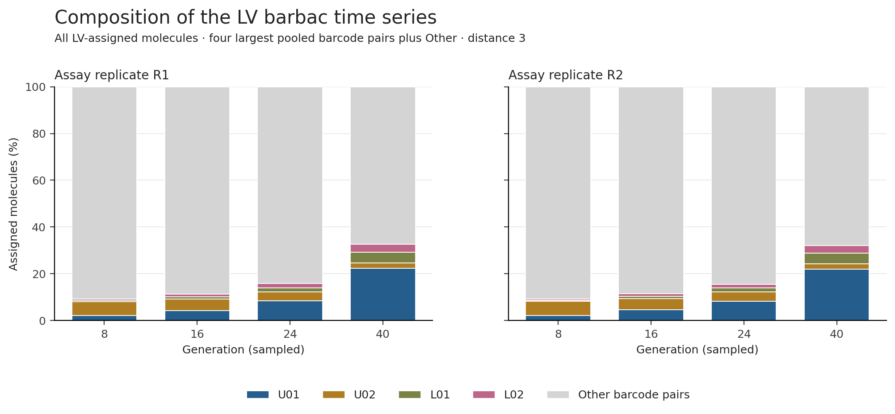
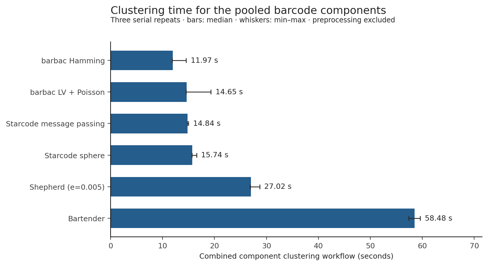

# Chen 2023 barcode time series

The complete hBFA1 / YPD subset is processed: **16,511,755 read pairs across eight
samples**, at generations 8, 16, 24 and 40 in two biological assay replicates.
The shared mapping/extraction workflow retains **16,051,344 UMI-deduplicated
molecules (97.21% of input pairs)** for the method comparison.
This percentage is extraction retention, not clustering accuracy.

For barbac LV with the Poisson option, median count-rank agreement with the
publication is **Spearman ρ = 0.999968** across the eight samples.
The median fraction of input molecules assigned to exact published pair IDs is
**83.09%**. Both barcode components together take
**14.65 seconds** to cluster at the median of three
fresh serial repeats. Shared FASTQ preprocessing and trajectory reconstruction
are outside that clustering time.

| Method | Median Spearman ρ | Median molecule mass on published pair IDs | Clustering, median seconds | Unassigned molecules, all samples |
|---|---:|---:|---:|---:|
| barbac LV + Poisson | 0.999968 | 83.09% | 14.65 | 0 |
| barbac Hamming | 0.999929 | 82.90% | 11.97 | 0 |
| Shepherd (e=0.005) | 0.930542 | 80.30% | 27.02 | 189,126 |
| Starcode sphere | 0.999991 | 83.13% | 15.74 | 0 |
| Starcode message passing | 0.999990 | 83.14% | 14.84 | 0 |
| Bartender | 0.999931 | 82.93% | 58.48 | 0 |

The correlation uses all 2,314 published pair IDs at each sample, inserting zero
for absent method calls. Exact identifier matching is sensitive to different
centroid choices. Publication counts have additional filtering and correction
steps; they are a comparison reference, not known biological truth. These
measurements do not establish that one method has the highest true accuracy.
Starcode has slightly higher reference agreement; Hamming barbac has the lowest
median clustering time. LV barbac combines very high agreement with a similar
median time to Starcode.

The sample-median overlap above differs from the pooled molecule-weighted
calculation: **19.70%** of all LV molecules
fall outside the published pair set. Two abundant unpublished pairs account for
**69.47% of this unmatched mass**.
Each has BC2 at least seven edits from every published BC2, outside the tested
distance-three correction radius. Thus the discrepancy includes abundant
identities absent from the reference. This does not establish whether those
pairs are biological lineages, artifacts, or removed by the author's filters.
The paper describes lane-intersection and chimera filtering; reproducing the
full author filtering and lineage-selection process is separate from this
clustering comparison. No diagnostic remapping was applied.

Shepherd could not automatically estimate an error rate for the low-diversity
BC1 component. Both components therefore use its documented `-e 0.005` option,
the rate already configured for barbac. This is a supplied assumption, not a
measured sequencing error rate or a value selected against publication counts.
The failed automatic attempt is retained in the generated audit files and is
excluded from the three successful timing repeats.

The trajectory comparison normalizes each method and the publication over the
same 2,314 published pair IDs. The table above exposes each method's molecule
mass outside that set rather than hiding it through normalization. L01–L03 are
chosen by pooled published abundance, before inspecting method agreement.

The composition plot instead uses **all LV-assigned molecules**, including pairs
absent from the publication. Its four largest pairs are selected by pooled LV
counts. [figure_lineages.csv](figure_lineages.csv) identifies every labeled pair.

## Reproducible outputs and interpretation

- `time_series_METHOD.csv.gz`: complete eight-sample tables for every observed
  method pair and every published pair, including explicit zero observations,
  counts, replicate, generation, method and both normalization denominators.
- `sample_method_agreement.csv`: all 48 sample/method comparisons, including
  unmatched and unassigned molecule counts, count-rank agreement and total
  variation between frequencies conditioned on the published pair set.
- `extraction_summary.csv`: reconciled quality, BAM extraction and UMI outcomes.
- `clustering_runs.csv`, `combined_clustering_times.csv`, `repeat_stability.csv`:
  all timing repeats, reported maximum child RSS, and membership stability.
- `published_identity_categories.csv`: molecule mass by exact component/pair
  membership in the published set, for every sample and method.
- `largest_unmatched_LV_pairs.csv`, `unmatched_diagnosis.json`: largest absent
  pairs and their nearest published component edit distances, without remapping.
- `provenance.json`: parameters, source hashes, tool hashes and input hashes.
- Every figure is also available as PDF and SVG for manuscript use.

The workflow is FastQC → PEAR → minimap2 → indexed BAM → `barbac_xtr()` flank
extraction → original-pair Q30 filtering and UMI deduplication. It uses the
existing `barbac_env`. Observed 24–28-base components remain variable length;
BC1 is reverse-complemented into the author's orientation. PEAR consensus can
change the original-mate barcode sequence; those changes are counted in the
extraction audit. Both components are clustered separately and their pair
identities preserved. All methods receive the same inputs at distance 3.

Clustering is retrospective: pooling all four generations uses information
from later samples. Frequency trajectories describe this selected fitness
assay; no fitness coefficients, causal effects or prospective performance are
claimed. Publication-specific GC, lane, chimera and abundance filters are not
re-created here, so differences may arise before or after clustering.

Source: [Chen, Johnson, Hérissant et al. (2023)](https://doi.org/10.7554/eLife.92899),
BioProject PRJNA912754, with author analysis files pinned to revision
`a375a116bf69160f634a3d6a1b0ecc53ad62d142`.
