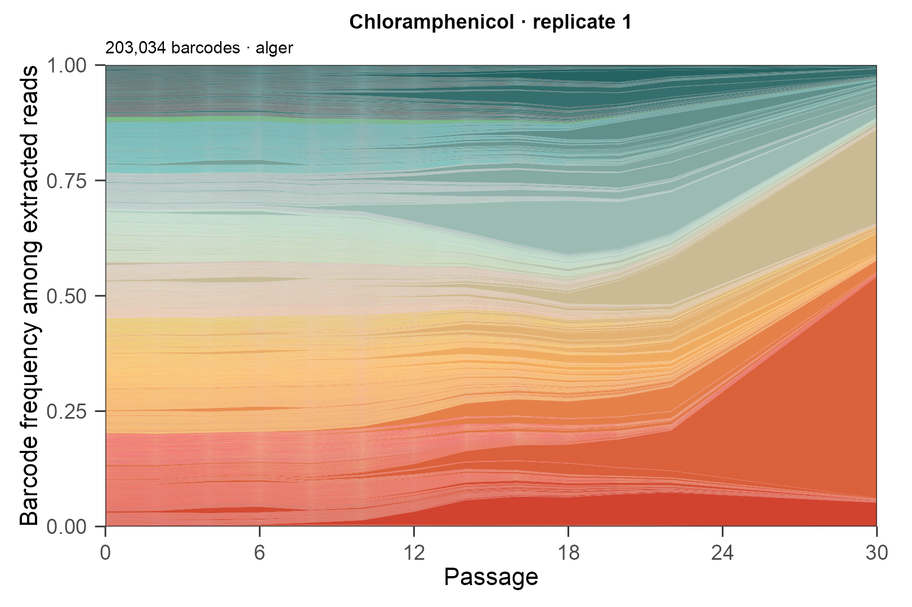
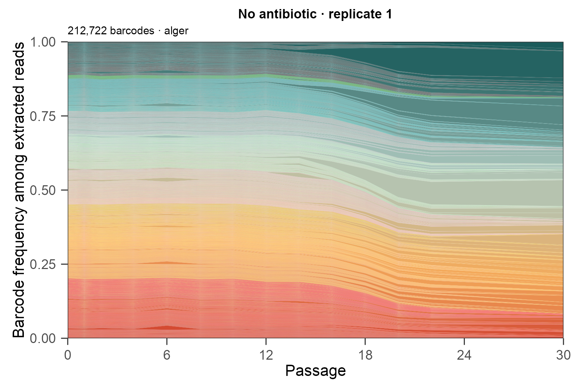
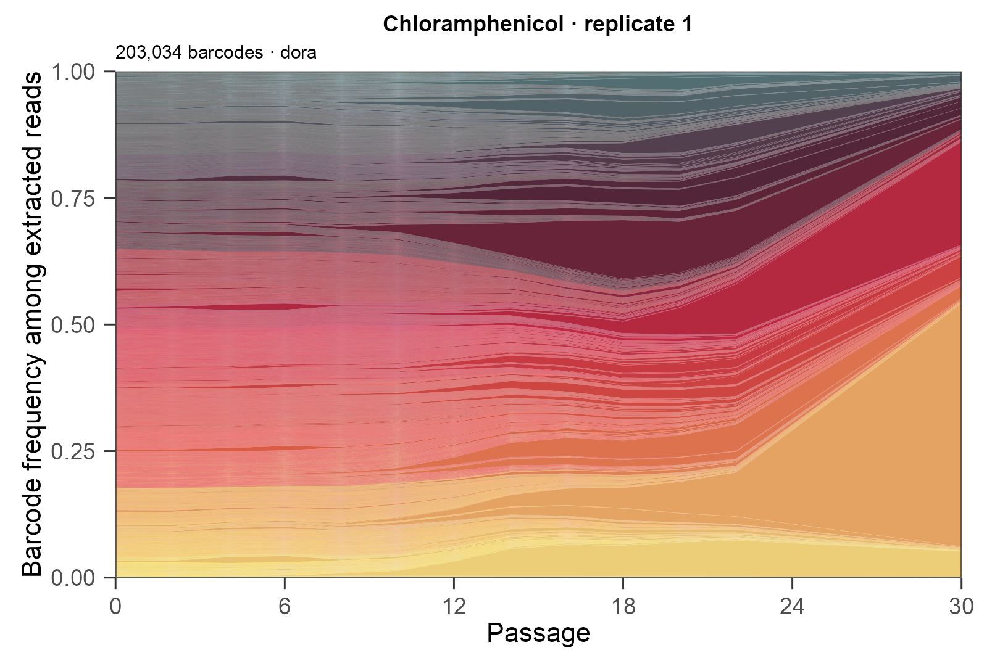
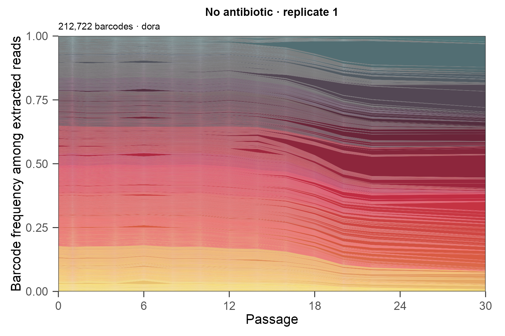
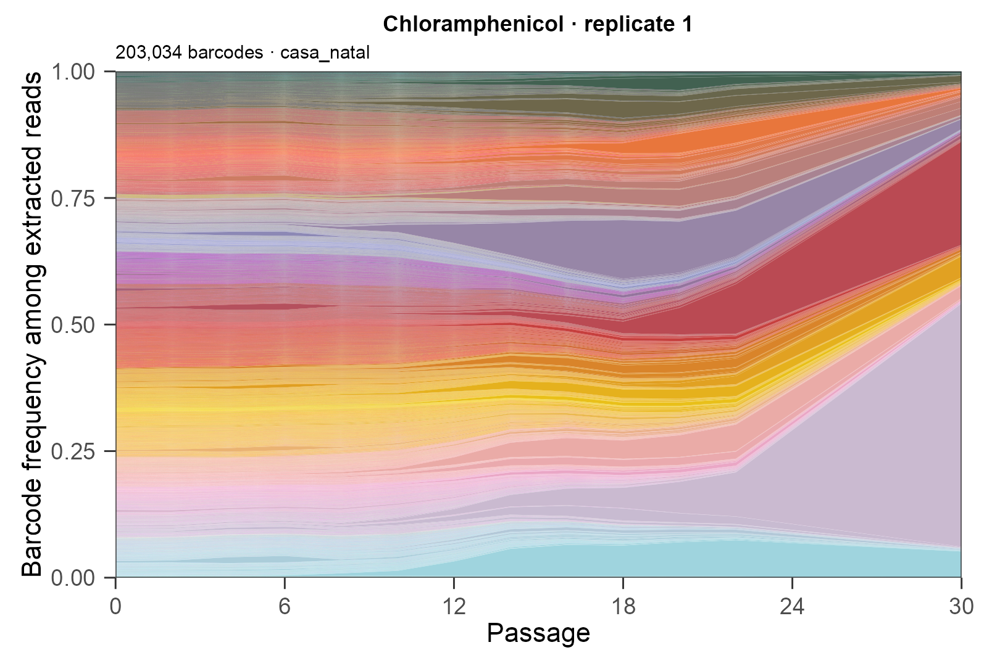
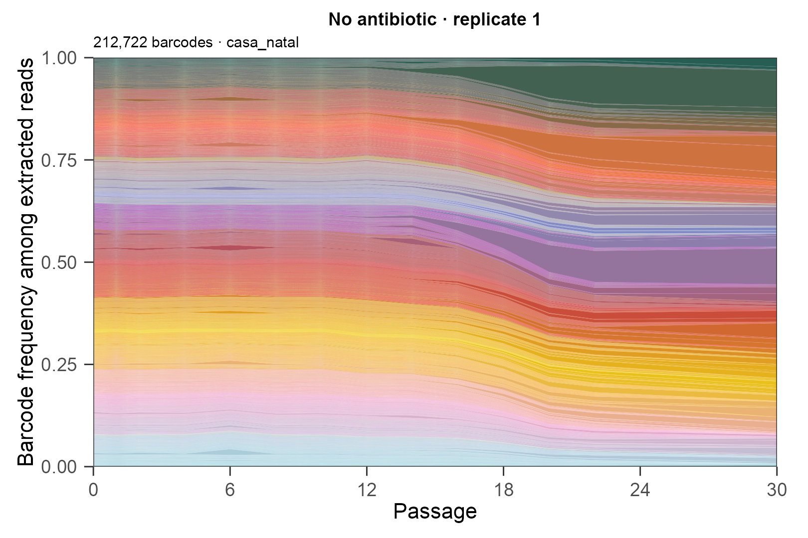
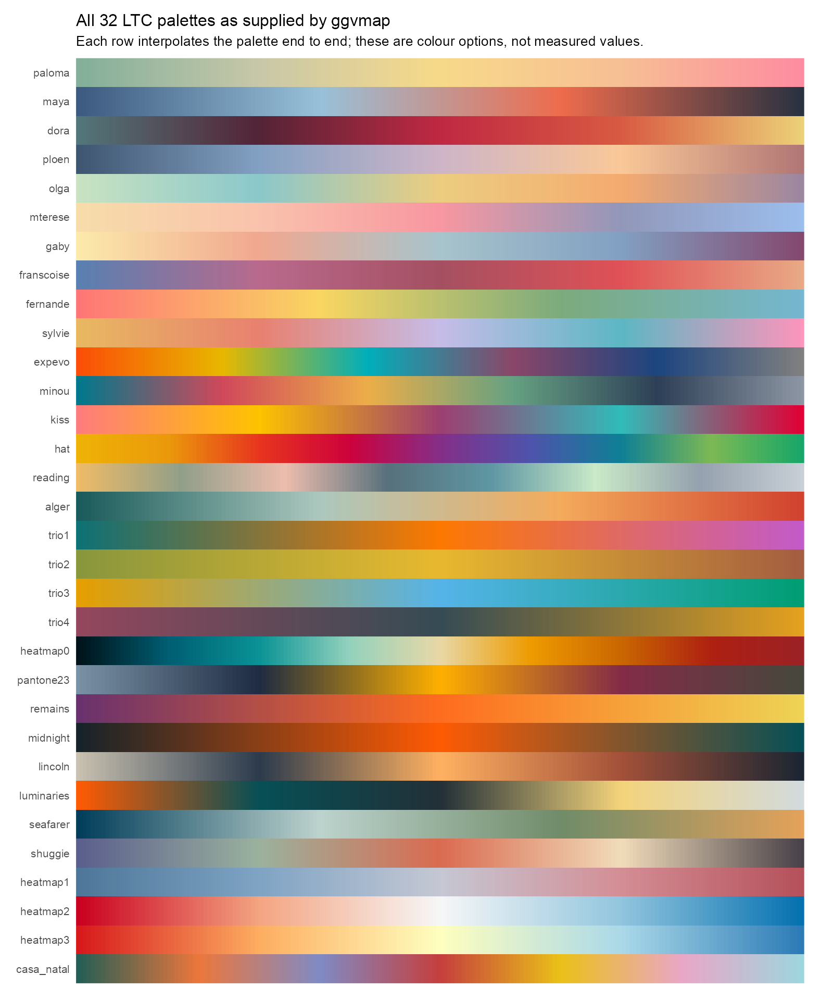

```{r validate}
source('../provenance_helpers.R')
for(well in c('A3','A1')) {
  z <- jsonlite::read_json(file.path('palette_preview',paste0(well,'_validation.json')))
  stopifnot(z$all_barcodes_individual,z$full_frequencies_verified,z$geometry_unchanged)
  for(im in z$images) stopifnot(digest::digest(file=file.path('palette_preview',im$path),
    algo='sha256')==im$sha256)
}
```

These previews use **every barcode** from chloramphenicol replicate 1 and
no-antibiotic replicate 1. Band widths, barcode order, zero counts and the
extracted-read denominator are identical across palette choices. The same
barcode receives the same colour in the treatment and control within each choice.
No barcodes are combined or filtered out.

The palettes come from [`ggvmap::vm_palettes()`](https://github.com/loukesio/ggvmap#vm_palettes--the-built-in-colours),
which includes 32 LTC palettes and curates some fills for a white background.
We interpolate each selected palette end to end to obtain a colour for every
barcode. Colour identifies a barcode; neither brightness nor hue represents its
frequency. Many thin bands and neighbouring colours remain indistinguishable at
screen resolution with this many lineages.

[Open the main report with the plasma reference plots](report.html#following-the-mixture-over-time).

```{=html}
<style>
.palette-pair .column { min-width:0; }
.palette-pair img { width:100%; }
@media(max-width:700px) { .palette-pair { flex-direction:column; } .palette-pair > .column { width:100%!important; margin-left:0!important; } }
</style>
```

:::::: {.panel-tabset}
## alger
::::: {.columns .palette-pair}
:::: {.column width="50%"}
**Treatment · replicate 1**

[](palette_preview/A3_alger.png)
::::
:::: {.column width="50%"}
**Control · replicate 1**

[](palette_preview/A1_alger.png)
::::
:::::
## dora
::::: {.columns .palette-pair}
:::: {.column width="50%"}
**Treatment · replicate 1**

[](palette_preview/A3_dora.png)
::::
:::: {.column width="50%"}
**Control · replicate 1**

[](palette_preview/A1_dora.png)
::::
:::::
## casa_natal
::::: {.columns .palette-pair}
:::: {.column width="50%"}
**Treatment · replicate 1**

[](palette_preview/A3_casa_natal.png)
::::
:::: {.column width="50%"}
**Control · replicate 1**

[](palette_preview/A1_casa_natal.png)
::::
:::::
::::::

## All 32 available palettes

The sheet below shows the interpolated options available from `ggvmap`. The
`heatmap0`–`heatmap3` palettes are ordered ramps; their diverging shapes should
not be interpreted as low/high barcode abundance when used for barcode identity.



## Use a palette with barbac

`barbac_ts_area()` already accepts a colour vector, so no clustering changes or
new barbac package dependency are needed:

```r
ids <- sort(unique(as.character(counts$barcode)))
base <- ggvmap::vm_palettes()$alger
colours <- grDevices::colorRampPalette(base)(length(ids))

barbac_ts_area(
  counts, min_total_count = 0, fill_missing = "zero",
  palette = colours, show_legend = FALSE
)
```

For multiple populations, generate the colours once using the union of barcode
identifiers, then pass the matching colours in each plot's barcode order.

Previews use ggvmap `r as.character(utils::packageVersion('ggvmap'))`.
The R script, exact palette snapshot and numerical validation receipts are in
`palette_preview.R` and `palette_preview/`. Click a plot for its full-size image
when the accompanying folder is available.
