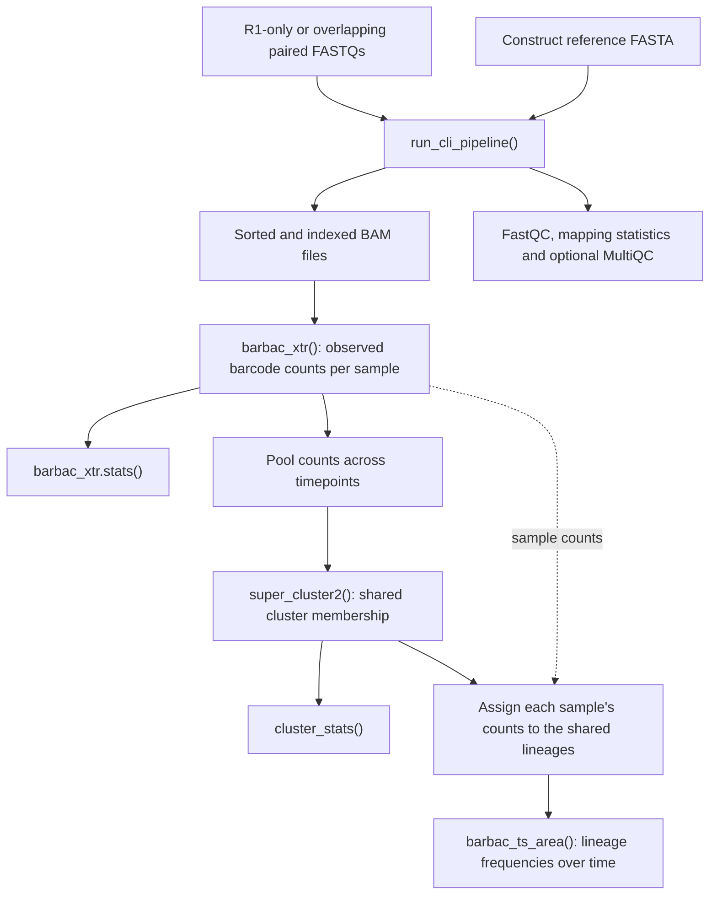

# From reads to lineage trajectories



`run_cli_pipeline()` performs **FastQC → optional PEAR → minimap2/samtools → BAM statistics**,
plus MultiQC when available. R1-only rows map directly; paired rows use PEAR
assemblies. Call `barbac_xtr()` and the downstream R functions explicitly after
that. The wrapper does not automatically extract barcodes, cluster them or
assemble a time series.

## 1. Prepare reads and the mapping reference

Use one sample per row, with unique sample names and matching `R1`/`R2` paths:

```r
samples <- data.frame(
  sample = c("sample1", "sample2"),
  R1 = c("data/sample1_R1.fastq.gz", "data/sample2_R1.fastq.gz"),
  R2 = c("data/sample1_R2.fastq.gz", "data/sample2_R2.fastq.gz")
)
write.csv(samples, "samples.csv", row.names = FALSE)
```

Omit `R2`, or set it to `NA` or `""`, to map R1 directly. A table may mix
paired and R1-only samples. PEAR is only required for rows with R2. Paired mode
requires overlapping reads and excludes unmerged pairs.

```r
single <- data.frame(sample = "sample1", R1 = "data/sample1_R1.fastq.gz")
pipeline <- run_cli_pipeline(single, "data/cassette.fasta", "results_r1")
```

Use a new or empty output directory for every run. Studio and the R pipeline
both support single-end and overlapping paired reads. Study-specific filters
and UMI deduplication must be applied in the relevant study workflow.

The reference FASTA must describe your sequenced construct with enough constant
flanking sequence for alignment. A barcode-cassette reference is appropriate for
the studies here. `ref_name` must exactly match its FASTA record name/BAM target.
Choose coordinates and flank patterns from that construct, rather than copying
another study's barcode positions.

## 2. Run preprocessing and mapping

```r
pipeline <- run_cli_pipeline(
  sample_table = "samples.csv",    # a data.frame also works
  reference = "data/cassette.fasta",
  output_dir = "results"
)
pipeline$stats
plot_bam_stats(pipeline$stats)
```

The returned list includes `bam_files` named by original sample label, a
`samples` table linking input modes to outputs, `stats`, output directories and
the executed `commands`. Required commands stop on failure and retain diagnostic
output in `log_file`. Optional MultiQC failures raise a warning and set
`multiqc_status` to `failed`. Mapping uses minimap2's short-read preset and
retains primary alignments only.

```text
results/
├── fastQC/                              # FastQC HTML and ZIP files
├── merged/
│   ├── sample1_ANC.assembled.fastq
│   └── bam/
│       ├── sample1_ANC.assembled_sorted.bam
│       └── sample1_ANC.assembled_sorted.bam.bai
├── multiqc/multiqc_report.html          # when MultiQC is available
├── bam_summary.csv
└── pipeline.log
```

`run_fastqc()`, `run_multiqc()`, `run_pear_merge()`, `run_minimap2()` and
`summarise_bam_stats()` are also available for explicit stage-by-stage execution.
See their help for paths and arguments; their default directories are not all
identical to the wrapper's defaults.

## 3. Extract barcodes with `barbac_xtr()`

The two modes serve different extraction designs. Coordinates are **one-based,
inclusive**. This example uses the verification fixture's reference name and
26-base locus; replace them for your own construct.

```r
bam <- pipeline$bam_files[["sample1"]]
barcode_csv <- barbac_xtr(
  bam_file = bam,
  ref_name = "verification_cassette",
  start_pos = 171, end_pos = 196,
  output_file = "results/sample1_barcodes.csv",
  min_count = 1
)
counts <- readr::read_csv(barcode_csv, show_col_types = FALSE)
```

**Fixed-coordinate mode** projects the reads onto the requested reference
interval. It returns fixed-width strings and can contain alignment gap/padding
characters; it is not the mode for preserving variable-length indel barcodes.
The function returns the CSV path, not a count table. Count-mode CSV columns are
`barcode`, `counts` and `barcode_length`. If `output_file` is omitted, the output
is beside the BAM; for the filename above it ends in `_sorted_barcodes.csv`.

**Flank mode** matches a capture group in the observed BAM query sequence:

```r
barcode_csv <- barbac_xtr(
  bam_file = bam,
  ref_name = "verification_cassette",
  start_pos = 171, end_pos = 196,
  flank_pattern = "AGTGAGACCTGA([ACGT]{24,28})ATTTCGGGTTCC",
  output_file = "results/sample1_flanked_barcodes.csv",
  min_count = 1
)
```

Here the constant flanks identify the barcode boundaries and the capture group
retains observed sequences of 24–28 bases. In this mode, coordinates select a
reference locus that the alignment must span with a base on each side; the
capture group determines the extracted sequence. Unmapped, secondary and
supplementary alignments are excluded, as are alignments with hard clipping or
skipped reference regions. Matching uses reference-oriented query sequences.
`reverse_complement = TRUE` changes the orientation before matching;
`read_window` restricts the query search window after that operation.

Use `include_read_ids = TRUE` to obtain `read_id`, `barcode`, `barcode_length`
rows for downstream read-level joins instead of aggregated counts. This requires
`min_count = 1`. Read names can repeat between mates in paired BAMs; preserve mate
identity in those joins. Extraction does not perform UMI deduplication.

For the E. coli study, the actual
[288-base cassette](../benchmark/time_series_jasinska2020/reference/cassette.fasta)
has a nominal **15-base** barcode masked at positions **11–25**. Its workflow
uses the downstream alignment anchor at **32–40** with
`flank_pattern = "^([ACGT]{10,20})TATCTCGGTAG"` and
`ref_name = "Jasinska2020_barcode_cassette"`. Those anchor coordinates do not
imply a nine-base barcode. See the
[extraction design and reference](../benchmark/time_series_jasinska2020/README.md#reference-and-extraction).

## 4. Inspect extraction diagnostics

```r
diagnostics <- barbac_xtr.stats(
  barcode_csv, barcode_length = c(24, 28),
  panel_labels = TRUE, return_details = TRUE
)
diagnostics$plot           # length, abundance and sequence-entropy panels
diagnostics$length_summary # numeric table, usable with gt::gt()
```

`return_details = FALSE` (the default) returns the combined patchwork plot.
The length summary distinguishes unique-sequence counts from read counts.
Sequence entropy measures nucleotide diversity *within a barcode*, in bits;
it is different from abundance-based Shannon diversity across lineages.

## Cluster and construct a time series

```r
clusters <- super_cluster2(
  barcode_csv,
  method = "lv", distance = 3,
  tie_break = "support", merge_ratio = 20,
  error_rate = 0.005, indel_model = "poisson"
)
cluster_stats(clusters)
```

The result contains `cluster_id`, `central_barcode`, list columns `all_barcodes`
and `all_counts`, and `sum_counts`. `distance` is the maximum allowed edit
distance. `error_rate` is a separate model parameter used in merging decisions.
`tie_break = "support"` uses one-edit neighbour counts when abundances tie;
the default is `"sequence"`. The Poisson indel model is opt-in. Set these options
for your library and controls; the example parameters are not universal optima.
Use `method = "hamming"` for fixed-length, substitution-only comparisons;
LV also handles insertions, deletions and positional shifts.

For a time series, pool barcode counts across the chosen samples, cluster that
pool once, then map each sample's counts through the resulting membership table.
This gives a consistent lineage identity across timepoints. The integration
script demonstrates the full join and checks every resulting count. Retrospective
pooling uses information from all included timepoints.

```r
# reads_long has one row per barcode/time, with columns barcode, time, counts
barbac_ts_area(
  reads_long, min_total_count = 0, fill_missing = "zero",
  palette = "alger"
)
names(barbac_palettes())             # all 32 built-in LTC palette names
barbac_palette("casa_natal", n = 100) # a colour vector for other plots
```

With `min_total_count = 0` and `fill_missing = "zero"`, every lineage receives
its own band and missing counts stay zero. Frequencies divide by the retained
barcode counts at each timepoint. The defaults are a count threshold of 10 and
an epsilon fill; select these explicitly when interpreting frequencies.
Bartender-wide tables with `Cluster.ID` and `time_point_*` columns are also accepted.

Named palettes are interpolated across barcodes. Custom colour vectors and the
Sailboat default remain available. For matching colours across populations,
build one mapping over the union of barcode IDs and pass the appropriate subset
to each plot; see the [paired palette examples](../benchmark/time_series_jasinska2020/r_report/palette_comparison.qmd).
Use `interactive = "ggiraph"` or `"plotly"` with the corresponding optional package
installed. The experimental report uses static R images for its very dense area
plots and interactive tables/other charts.


See the [Studio guide](../app/README.md) for uploading tables and FASTQs through the app.
