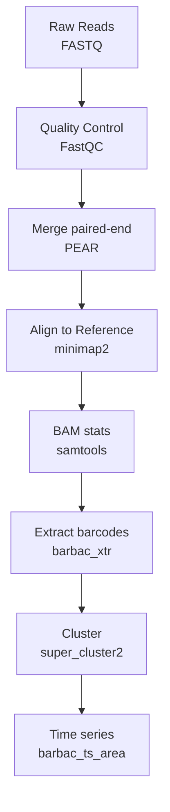

# barbac

[](https://lifecycle.r-lib.org/articles/stages.html#experimental)
[-blue.svg)](https://www.gnu.org/licenses/gpl-2.0)
[](https://github.com/loukesio/barbac/actions/workflows/R-CMD-check.yaml)
[](https://github.com/loukesio/barbac/pkgs/container/barbac)
[](https://loukesio.github.io/barbac/)
[](https://github.com/loukesio/barbac/stargazers)

**barbac** (***bar**code **b**ioinformatics **a**nalysis and
**c**lustering*) is an R package for end-to-end DNA barcode lineage
tracking. It provides both a lightweight wrapper around the
bioinformatics pipeline used to extract barcodes from FASTQ reads
(FastQC → PEAR → minimap2 → samtools) and a native R clustering routine,
[`super_cluster2()`](https://loukesio.github.io/barbac/reference/super_cluster2.md),
backed by a bit-parallel 64-bit edit-distance kernel written in C++. On
the Johnson et al. (2023) reference benchmark, barbac reaches
statistical parity with Shepherd at ~1.7× the speed; on datasets with
indel errors it substantially outperforms Shepherd on false-positive and
wrong-sequence rates.

------------------------------------------------------------------------

## Installation

``` r

# Install development version from GitHub
if (!require("remotes")) install.packages("remotes")
remotes::install_github("loukesio/barbac")

library(barbac)
```

`barbac` links to Rcpp and requires a working C++ toolchain. It also
depends on the Bioconductor packages `GenomicAlignments` and
`GenomicRanges` (installed automatically). The upstream CLI pipeline
(FastQC, PEAR, minimap2, samtools) is optional and provisioned via
[`configure_environment()`](https://loukesio.github.io/barbac/reference/configure_environment.md)
on demand.

## Prefer a container? Use the pre-built image

Every push to `main` builds and publishes a Docker image with R,
Bioconductor, and the full FASTQ→BAM CLI stack (FastQC, PEAR, minimap2,
samtools, MultiQC) already installed, alongside the latest `barbac`.
Zero conda dance:

``` bash
docker pull ghcr.io/loukesio/barbac:latest

# Start an R session with your working directory mounted at /data
docker run --rm -it -v "$(pwd)":/data ghcr.io/loukesio/barbac:latest R

# Or run a script non-interactively
docker run --rm -v "$(pwd)":/data ghcr.io/loukesio/barbac:latest \
  Rscript /data/my_analysis.R
```

Tags: `latest` on `main`, `<short-sha>` per commit, `0.1.0` / `0.1` on
version tags.

## Environment setup (optional — only for the FASTQ→BAM pipeline, native install)

``` r

# One-time: create the conda environment with FastQC, PEAR, minimap2, samtools
configure_environment()

# Activate for this R session (adds the tools to PATH)
use_barbac_env()

# Sanity-check
check_barbac_tools()
```

------------------------------------------------------------------------

## Quick start — clustering

``` r

result <- super_cluster2(
  "path/to/reads.csv",   # or a data.frame with columns `barcode`, `counts`
  distance    = 3,       # max Levenshtein distance
  merge_ratio = 20       # distance-aware count-ratio merge guard
)

result
#> # A tibble: N x 5
#>   cluster_id central_barcode      all_barcodes all_counts sum_counts
#>   ...
```

[`super_cluster2()`](https://loukesio.github.io/barbac/reference/super_cluster2.md)
returns one row per cluster: the abundance-ranked centroid, the list of
member barcodes and their counts, and the summed abundance.

## Quick start — time-series visualisation

``` r

# Long-format input: (barcode, time, counts)
barbac_ts_area(reads_long,
               min_total_count = 10,
               include_late    = TRUE,   # keep barcodes appearing at later timepoints
               fill_missing    = "epsilon")

# Bartender-wide format is auto-detected
barbac_ts_area("path/to/cluster_output.csv")
```

Accepts either long-format or Bartender-wide input. If neither layout
matches,
[`barbac_ts_area()`](https://loukesio.github.io/barbac/reference/barbac_ts_area.md)
errors with the expected schema. Late-appearing lineages are carried
through the full series with missing cells filled by ε (default `1e-6`)
or by zero.

------------------------------------------------------------------------

## The full FASTQ→lineage pipeline



### Define your samples

Provide a `samples.csv` file listing one sample per row. `sample` and
`R1` are required; `R2` is optional (single-end mode is used when it’s
missing).

``` r

sample_table <- data.frame(
  sample = c("sample1", "sample2", "sample3"),
  R1     = c("data/sample1_R1.fastq.gz", "data/sample2_R1.fastq.gz", "data/sample3_R1.fastq.gz"),
  R2     = c("data/sample1_R2.fastq.gz", "data/sample2_R2.fastq.gz", "data/sample3_R2.fastq.gz")
)
write.csv(sample_table, "samples.csv", row.names = FALSE)
```

| sample  | R1                       | R2                       |
|---------|--------------------------|--------------------------|
| sample1 | data/sample1_R1.fastq.gz | data/sample1_R2.fastq.gz |
| sample2 | data/sample2_R1.fastq.gz | data/sample2_R2.fastq.gz |
| sample3 | data/sample3_R1.fastq.gz | data/sample3_R2.fastq.gz |

### One-command pipeline

``` r

run_cli_pipeline(
  sample_table = "samples.csv",
  reference    = "data/Reference_barcodes.fasta",
  output_dir   = "results",
  log_file     = "barbac.log"
)
```

### Step-by-step

Prefer to run each stage explicitly? Click to expand.

``` r

samples <- "samples.csv"
ref     <- "data/Reference_barcodes.fasta"

# 1. Quality control
run_fastqc(samples)                            # -> results/fastQC/

# 2. Merge paired-end reads
run_pear_merge(samples)                        # -> results/merged/

# 3. Reference mapping
run_minimap2(merged_dir = "results/merged/",   # -> results/merged/bam/
             reference  = ref)

# 4. Mapping statistics
summarise_bam_stats(bam_dir = "results/merged/bam/")

# 5. Extract barcodes at fixed coordinates
barbac_xtr("results/merged/bam/sample1_sorted.bam",
           start_pos = 54, end_pos = 78)       # -> sample1_barcodes.csv

# 6. Cluster
result <- super_cluster2("sample1_barcodes.csv", distance = 3)

# 7. Visualise (once joined across timepoints)
barbac_ts_area(result_time_series)
```

### Output structure

    results/
    ├── fastQC/                  # Quality control reports
    │   ├── sample1_R1_fastqc.html
    │   └── sample1_R2_fastqc.html
    ├── merged/                  # PEAR merged reads
    │   ├── sample1_ANC.assembled.fastq
    │   └── bam/                 # Alignment results
    │       ├── *.bam
    │       └── *.bam.bai
    ├── stats/                   # Summary statistics
    │   └── mapping_summary.tsv
    └── pipeline.log

------------------------------------------------------------------------

## Benchmarks

### Parity with Shepherd on the Johnson et al. (2023) reference dataset

Same input (100,000 true barcodes, ~1.5M unique reads), same parameters
(max distance 3), same evaluation protocol.

| Method   | Pearson R |  FN% |  FP% |  WS% |        Time |
|----------|----------:|-----:|-----:|-----:|------------:|
| barbac   |      1.00 | 0.47 | 0.09 | 0.06 | **1.4 min** |
| Shepherd |      1.00 | 0.47 | 0.09 | 0.06 |     2.4 min |

470 of the 471 false negatives are shared between the two methods — both
fail on the same hard cases (mostly barcodes with count = 0 in the
input). See `benchmark/compare_with_shepherd.ipynb` for the full
analysis.

### Robustness on Illumina-quality data

We benchmarked barbac against Shepherd, Starcode, and Bartender on
10,000-barcode / 1M-read datasets under Illumina-quality error regimes
typical of experimental-evolution barcode sequencing: **0.5% per-base
substitution rate**, insertion+deletion rates of **0% and 0.5%**. Higher
indel rates typical of long-read platforms (PacBio, nanopore) are
outside the scope of this comparison.

| Condition | Method | Pearson R | FN% | FP% | WS% | Wall (s) | Algo (s) |
|:---|:---|---:|---:|---:|---:|---:|---:|
| **sub_only** (0% ins, 0% del) | barbac | 1.0000 | 0.44 | 0.47 | 0.43 | 4.3 | **0.7** |
|  | Shepherd | 1.0000 | 0.44 | 0.47 | 0.43 | 2.7 | 2.7 |
|  | Starcode | 1.0000 | 0.48 | 0.51 | 0.47 | 2.8 | 2.8 |
|  | Bartender | 1.0000 | 0.48 | 0.52 | 0.48 | 1.0 | 1.0 |
| **low_indel** (0.5% ins, 0.5% del) | **barbac** | **1.0000** | 1.55 | **3.36** | **1.57** | 5.7 | **2.4** |
|  | Shepherd | 0.9993 | 0.95 | 49.15 | 48.81 | 3.5 | 3.5 |
|  | Starcode | 1.0000 | 1.58 | 3.38 | 1.59 | 17.2 | 17.2 |
|  | Bartender | 0.9959 | 0.94 | 511.14 | 509.41 | 2.0 | 2.0 |

*Wall = end-to-end wall time. Algo = pure clustering time, excluding R
boot + package loading for barbac (Shepherd/Starcode/Bartender pay a
negligible boot tax so wall ≈ algo for them).*

**No-indel baseline.** All four methods are statistically
indistinguishable (R = 1.0000, FN/FP/WS all within 5 barcodes out of
10,000). Confirms the four-way validity check.

**Realistic Illumina indel regime (0.5%).** Two-tier picture:

- **barbac and Starcode are essentially tied for clustering accuracy** —
  both preserve R = 1.0000 and confine WS to ~1.6%. Both use Levenshtein
  natively.
- **Shepherd and Bartender break.** Shepherd’s WS rises 113-fold to
  48.81% (a **31-fold** gap versus barbac); Bartender’s rises to
  **509.41% (a 324-fold gap)**. Both rely on Hamming-based indexing that
  fragments indel variants into spurious centroids.

**Where barbac beats its Levenshtein peer (Starcode).**

- **~7× faster algorithm time** (2.4 s vs 17.2 s at low_indel; wall-time
  gap smaller because barbac pays a fixed ~3 s R-boot tax that Starcode
  does not).
- **R-native**, with an in-package Rcpp binding — no shelling out to a
  standalone C binary and parsing text output.
- **Integrated with the FASTQ→lineage pipeline** (`run_cli_pipeline`,
  `barbac_xtr`) and the time-series visualisation (`barbac_ts_area`) in
  the same package.

Full reproducibility scripts are in
[`benchmark/indel_experiment/`](https://loukesio.github.io/barbac/benchmark/indel_experiment/).
The experiment runner also produces mid- and high-indel conditions;
those regimes (2%+ indels) are outside the Illumina scope of the current
paper and treated as future work.

------------------------------------------------------------------------

## Documentation

- 📖 **Package website:** <https://loukesio.github.io/barbac/>
- 📘 **Getting-started vignette:**
  [`vignette("barbac", package = "barbac")`](https://loukesio.github.io/barbac/articles/barbac.md)
  or `browseVignettes("barbac")`
- 💻 **Function help:**
  [`?super_cluster2`](https://loukesio.github.io/barbac/reference/super_cluster2.md),
  [`?barbac_ts_area`](https://loukesio.github.io/barbac/reference/barbac_ts_area.md),
  [`?run_cli_pipeline`](https://loukesio.github.io/barbac/reference/run_cli_pipeline.md),
  [`?barbac_xtr`](https://loukesio.github.io/barbac/reference/barbac_xtr.md),
  [`?configure_environment`](https://loukesio.github.io/barbac/reference/configure_environment.md)

## Support

|  |  |
|----|----|
| 🐛 **Report issues** | [github.com/loukesio/barbac/issues](https://github.com/loukesio/barbac/issues) |
| 💡 **Feature requests / discussion** | [github.com/loukesio/barbac/discussions](https://github.com/loukesio/barbac/discussions) |
| 📧 **Email** | <theodosiou@evolbio.mpg.de> |
| 🦋 **Bluesky** | [@bioinformatician.bsky.social](https://bsky.app/profile/bioinformatician.bsky.social) |

## Citation

If you use `barbac` in published work, please cite:

> Theodosiou L, Farr AD, Rainey PB (2026). *barbac: A versatile tool for
> analysing DNA barcode sequences.* Bioinformatics (in preparation).

## License

GPL (≥ 2). See [LICENSE](https://loukesio.github.io/barbac/LICENSE).

------------------------------------------------------------------------

*barbac — barcode bioinformatics analysis and clustering.*
