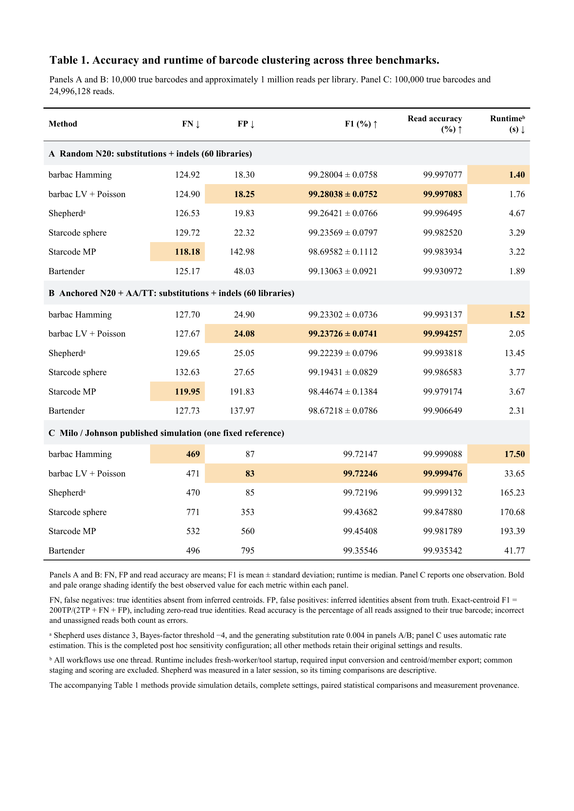

# barbac: fast DNA barcode clustering from reads to lineage trajectories

Loukas Theodosiou¹*, Andrew D. Farr² and Paul B. Rainey¹˒²

¹ Department of Microbial Population Biology, Max Planck Institute for
Evolutionary Biology, Plön, Germany.
² Laboratory of Biophysics and Evolution, CBI, ESPCI Paris, Université PSL,
CNRS, Paris, France.
* Correspondence: theodosiou@evolbio.mpg.de

**Abstract**

**Motivation:** DNA barcode analysis requires accurate error correction and
consistent lineage counts across time, including libraries containing indels.

**Results:** We present barbac, an R/C++ workflow with a local Shiny interface.
Its abundance-aware Levenshtein engine achieved the highest exact-centroid F1
and read-assignment accuracy among six configurations on two replicated
simulated designs and a deposited benchmark. The Hamming configuration was
fastest. Paired comparisons supported LV's F1 advantage over Bartender and
both Starcode configurations; a completed Shepherd sensitivity comparison
also favoured LV. Single-end and overlapping paired-end workflows connect
barcode extraction, clustering, statistics and lineage plots.

**Availability and implementation:** R/C++, GPL ≥2;
[https://github.com/loukesio/barbac](https://github.com/loukesio/barbac).
The submitted release and test-data archive identifier will be added before submission.

**Contact:** theodosiou@evolbio.mpg.de

**Supplementary information:** Benchmark methods, statistical comparisons,
execution records and application analyses accompany this manuscript.

**1 Introduction**

Cell barcoding is an increasingly valuable technique for tracking cell
lineages in experimental systems. By inserting short, unique DNA barcode
sequences into individual cells, researchers can trace the relationships
and dynamics of clones across multiple generations (Ba *et al.*, 2019;
Blundell and Levy, 2014; Levy *et al.*, 2015; Theodosiou *et al.*, 2023;
Geiler-Samerotte and Lang, 2023; Masuyama *et al.*, 2019; Woodworth *et
al.*, 2017; VanHorn and Morris,
2021). When paired with
time-series sampling, barcoding enables quantification of growth,
mutation, and other eco-evolutionary characteristics of cell populations
(Levy *et al.*, 2015; Fasanello *et al.*, 2020; Jasinska *et al.*,
2020). However, realising
the potential of cell barcoding requires overcoming computational
challenges in extracting and analysing barcode sequence data generated
by high-throughput sequencing. Raw sequences contain errors and must be
accurately clustered to progenitor barcodes before connecting into cell
lineage trees (Johnson et al.,
2023).

To generate barcode sequencing data, barcodes are first integrated into
target genomes using CRISPR-mediated insertion or transposon mutagenesis
via helper plasmids (Borchert *et al.*, 2022; Zhu *et al.*, 2019;
Theodosiou *et al.*, 2023; Jasinska *et al.*, 2020; Levy *et al.*,
2015). Cells are then
cultured over time, with population samples collected at specific
intervals. Following DNA extraction and library preparation,
high-throughput sequencing produces read data containing many copies of
the barcode of each cell (Jasinska et al., 2020; Theodosiou et al.,
2023; Vasquez et al.,
2021). An ideal workflow
would process these reads to identify barcode sequences, cluster similar
sequences originating from a common progenitor, and connect barcodes
into lineages across time in a time-sufficient manner.

Current computational approaches for lineage barcoding data typically
address individual analytical steps rather than supporting end-to-end
workflows. Considerable effort has been devoted to improving barcode
error correction and clustering barcode families into lineages
(Tavakolian et al., 2022).
Nevertheless, important opportunities remain to advance lineage
reconstruction over time and to increase the flexibility of clustering
methods for diverse experimental contexts. Among existing tools,
Bartender stands out by offering built-in functionality for longitudinal
lineage tracking through the matching of barcode clusters across
multiple time points (Zhao et al.,
2018). Bartender applies a
statistical clustering strategy based primarily on Hamming distances,
allowing it to effectively distinguish true barcodes from sequencing and
PCR artifacts. However, its reliance on identifying the most abundant
barcodes at early sampling points, coupled with the absence of
correction mechanisms for insertion or deletion (indel) errors, may
limit its accuracy in more complex experimental settings.

Alternatively, Starcode utilizes an exact all-pairs search within a
defined Levenshtein distance to cluster barcodes rapidly, accommodating
insertion-deletion errors effectively. Starcode uses an efficient search within a fixed distance
threshold without an explicit error model, creating potential trade-offs
in clustering precision (Johnson et al., 2023; Zorita et al.,
2015). Addressing some of
these limitations, the more recent Shepherd algorithm incorporates a
k-mer indexing scheme alongside a Bayesian model of sequencing error
rates. Shepherd achieves high clustering precision, substantially
reducing spurious lineage counts, yet its rigorous filtering approach
can inadvertently exclude barcodes exhibiting unexpected sequence
variations, and it imposes a greater computational burden (Tavakolian
et al., 2022; Johnson et al.,
2023).

Beyond barcode-specific solutions, general-purpose clustering tools such
as CD-HIT (Fu *et al.*,
2012) and DNAClust (Ghodsi
*et al.*, 2011), along with
specialized error-correction pipelines, have also been applied .
However, barcode-centric methods like Bartender, Starcode, and Shepherd
consistently outperform these alternatives in accuracy when denoising
and clustering barcode data (Johnson et al.,
2023). Importantly,
Bartender remains the only tool among these with built-in functionality
for directly tracking lineages across time points, whereas other methods
require supplementary post hoc analysis.

To address these gaps, we present barbac, an R package and accompanying
local Shiny interface for lineage barcoding analysis. barbac implements an
end-to-end workflow that begins with raw FASTQ files, performs barcode extraction
and error correction, and reconstructs lineage frequencies over time. Users can
also start directly from extracted barcode counts. Its native C++ implementation
supports Hamming and Levenshtein distances with abundance-aware centroid
assignment. For time-series analysis, counts can be pooled across samples to
define shared memberships, including lineages first observed at later timepoints.
The clustering engine uses a configured error-rate approximation and deterministic
ordering; it does not infer genealogical relationships among distinct barcodes.
The R workflow and downloadable analysis records support reproducible use from
both scripts and the local interface.

To demonstrate the utility of barbac, we compared two independently simulated
barcode designs with substitutions and repeat-dependent indels, using an error
model adapted from Johnson et al. (2023), and their deposited benchmark. We also
processed published experimental barcode time series to illustrate extraction,
clustering and lineage visualization.

**2 System and methods**

**2.1 From sequencing reads to barcode counts**

The public `run_cli_pipeline()` accepts a sample table containing R1 paths and
optional R2 paths. FastQC assesses the input reads. R1-only samples map directly;
overlapping paired reads are assembled with PEAR (Zhang et al., 2014) before mapping, and unassembled
pairs do not enter downstream analysis. Minimap2 (Li, 2018) uses its short-read preset,
with secondary alignments disabled. Samtools (Danecek et al., 2021) removes secondary and supplementary
alignments and produces sorted, indexed BAM files. Primary mapped and unmapped
counts, command logs and command-level elapsed times are saved. MultiQC summarizes
QC reports when available. This wrapper ends at BAM and QC outputs (Figure 1).

`barbac_xtr()` extracts barcodes from primary mapped reads using reference
coordinates or a supplied flank pattern. Variable-length flank extraction retains
observed insertions and deletions instead of forcing all barcodes to a nominal
length. The resulting CSV records each distinct sequence, its count and length.
Length, abundance and entropy diagnostics are available through
`barbac_xtr.stats()`. Study-specific quality filters and UMI deduplication must
be specified separately. Neither FASTQ quality scores nor mapping tools are
required when `super_cluster2()` receives an existing barcode-count table.

{width=178mm}

**2.2 Barcode designs, error generation and reference data**

The principal comparison comprises random N20 barcodes, an anchored design
`NNNNNAANNNNNAANNNNNTTNNNNN`, and the deposited Johnson et al. (2023) simulation
(referred to here as Milo). Both new designs contain 20 variable positions; the
anchored construct is 26 nt long. We generated 60 independent libraries per
design, each with 10,000 intended identities and one million expected reads.
Within each seed, designs share variable identities and parent abundances.
Abundances follow a scaled exponential mixture: 9,989 ordinary identities with
mean 1, ten intermediate identities with mean 10 and one abundant identity with
mean 1,000, normalized before Poisson read sampling.

Johnson et al. (2023) measured repeat-associated indel frequencies in barcode
sequencing experiments and incorporated these rates into a simulation with
0.4% substitutions per base. We use the archived homopolymer-rate table without
inflation and apply the same substitution probability, 0.004. Indel events are
allocated recursively, updating repeat coordinates after each event. A repeat
longer than the measured support of 13 bases stops further indel recursion for
the affected reads; their counts, origin labels and subsequent substitutions
remain intact. This boundary affected 249 of 119,992,068 reads across 16 of 120
libraries. The model represents a specified barcode error process; it does not
claim to calibrate every instrument or protocol, and it does not explicitly
model all dinucleotide, PCR-family or synthesis effects.

The fixed Milo input contains 100,000 listed true identities, 1,544,850 distinct
observed sequences and 24,996,128 reads. It was used during development. Its
reference count table and origin labels differ at four parents by six reads in
total absolute difference, while identities and overall totals reconcile. We
retain the deposited centroid truth and score read assignments against the
origin labels. Independent inference uses the newly generated libraries;
Milo results are descriptive. All generated evaluation seeds were frozen before
the final campaign and were not used to select subsequent Barbac changes.

**2.3 Competing methods and metrics**

We evaluated barbac LV and Hamming, Shepherd, Starcode sphere and message passing,
and Bartender, each with distance limit three. Both Barbac modes use support
ordering, merge ratio 20, configured error proxy 0.005 and disabled design scoring.
LV enables the existing Poisson indel option; Hamming retains its limited
rare-indel rescue. Starcode message passing uses ratio 5. Bartender uses seed
length 5, step 1, cutoff 1, z = 5 and forward direction. Native clustering and
external tools use one thread for this benchmark. Complete commands, versions
and source fingerprints are supplied with Table 1.

The original frozen Shepherd configuration used Bayes-factor threshold +4 and
automatic substitution-rate estimation. Ten of 120 new simulated inputs failed
in that estimator. A separately registered, post hoc sensitivity configuration
uses Shepherd's documented threshold −4 and the known generating substitution
rate 0.004 on every new library; Milo retains automatic estimation. Both changes
were applied consistently, without an accuracy-based configuration search.
Table 1 presents this completed comparison and reuses all other method results.
Original Shepherd outcomes and the two unavailable original contrasts remain
archived. Shepherd primarily uses Hamming distances and separately corrects
single insertions and deletions; it is not a general Levenshtein engine.

For exact-centroid scoring, TP counts output strings present in the true set,
FN counts missing true strings, and FP counts extra output strings. F1 is
`2TP/(2TP + FN + FP)`. All designed identities remain in the denominator,
including zero-read identities. Read-assignment accuracy is the fraction of
input reads assigned to their labelled true parent; incorrect and unassigned
reads both reduce this metric. Accuracy summaries average library-level scores,
with sample standard deviation shown for F1. This F1 is distinct from a
purity/completeness harmonic mean. Input counts, membership uniqueness and
output totals were reconciled before scoring.

**2.4 Paired inference and timing scope**

The original primary family contains eight LV-versus-external comparisons:
four external configurations in each of two designs. We calculated paired-t
one-sided lower confidence bounds at alpha = 0.05/8 and paired bootstrap bounds
at the same level using 100,000 whole-library resamples. Six original contrasts
with Bartender and Starcode were complete. The two additional Shepherd sensitivity
contrasts retain the same conservative alpha but remain post hoc. No
population-level test is inferred from the single Milo dataset.

Clustering workflow time includes a fresh worker, tool/package startup, required
input conversion and canonical centroid/member exports. Shared staging, scoring
and hashing are excluded. Original runs were serial. Twenty-eight calls affected
by computer sleep were repeated once under a registered repair, with identical
clustering outputs required; these replacements were retained unconditionally.
The 121 completed Shepherd calls were measured in a later session, with lightweight
diagnostic file reads overlapping early calls. Their runtime comparison is
descriptive. The complete raw-read application timing described below measures
a separate workflow and must not be compared directly with Table 1 times.

**3 Algorithm and implementation**

**3.1 Abundance-aware centroid assignment**

`super_cluster2()` collapses exact duplicate sequences, processes sequences in
abundance order and returns centroids, complete memberships and conserved counts.
For equal counts, the optional support ordering sums the counts of one-edit
neighbours that are no more abundant than the candidate, with sequence order as
the final deterministic tie rule. It uses observed counts rather than truth
labels and makes results independent of input row order.

The v14 native engine searches existing eligible centroids within the requested
distance and selects an assignment using a count-aware approximation based on
parent abundance, edit distance and the configured error proxy. A distance-dependent
count-ratio guard protects plausible separate identities. Exact candidate
partitions, bit-parallel distance kernels and conservative abundance/score bounds
avoid comparisons that cannot change the selected parent. This is greedy centroid
assignment, not graph connected-component clustering. Search acceleration and
merge acceptance are separate operations; recognizing an indel does not alone
justify merging its sequence into another identity. The search selects the
highest-scoring eligible centroid; a guard-blocked candidate does not suppress
a lower-scoring acceptable parent.

For parent count $n_p$, child count $n_c$, distance $d$ and comparison length
$L$ (the larger sequence length), the ranking score is

$$S = \log(1+n_p) + d\log(e/a) + \max(0,L-d)\log(1-e) - 0.15\log(1+n_c),$$

with $a=5$ for LV and $a=3$ for Hamming, and configured error proxy $e$.
For LV distances 1, 2 and 3, the ratio guard applies when child counts reach
10, 5 and 2, respectively, requiring parent-to-child ratios of 20, 60 and 100
under the reported settings. Hamming retains ratio 20 and child-count floor 10.
These are configured heuristics, not learned assay-specific parameters.

A local refinement stage can promote absorbed distance-two-or-more sequences
whose counts exceed the expected exact-edit error burden, then reassign members
to better-supported local representatives. LV uses its conservative local error
expectation; Hamming refinement uses the binomial Bayes criterion described for
Shepherd (Tavakolian et al., 2022). Subsequent cleanup and the Hamming mode's limited
rare-indel rescue are retained in the versioned native implementation.

The opt-in LV Poisson exception permits a repeated-base single insertion or
deletion to pass an otherwise blocking ratio guard when its count is compatible
with an expected-error approximation. It uses the configured error proxy as a
deletion-rate upper-bound proxy and one quarter of that rate for a specific
inserted base, multiplied by equivalent gap positions; the upper-tail threshold
is 0.01. It neither learns the simulation's repeat-specific rates nor provides
a platform-calibrated posterior. It remains an explicit option because genuine
nearby length variants can satisfy the same criterion. The package default is
`indel_model="none"`; Table 1 evaluates the stated enabled configuration.

**3.2 Reproducible analysis and local interface**

Counts can be pooled over all timepoints within each independent population to
define one membership map, then assigned back to their samples. This retrospective
pooling includes later observations when defining shared identities. It should
not be interpreted as reconstruction of a genealogical tree or prospective
prediction. `cluster_stats()` summarizes clusters and abundance, while
`barbac_ts_area()` plots lineage frequencies with configurable zero filling,
abundance filtering and 32 built-in LTC palettes. Static and interactive outputs
use the same prepared counts.

Barbac Studio supplies local barcode-count and raw-read uploads, including R1-only
input, and calls the same native engine. A labelled publication LV preset selects
the Table 1 settings. Downloads include extracted counts, centroids, memberships,
sample counts, statistics, settings, source/build identifiers, an R result and a
self-contained HTML report. Large populations retain every output count; Studio
defers figures above 5,000 lineages per population to direct R plotting. Native clustering time is recorded separately from
the broader analysis time. Synthetic examples and local video walkthroughs allow
users to inspect the workflow without submitting data to a public service.

The 0.2.1 release retains the verified v14 native clustering implementation and
adds command-level workflow timings. Lazy loading of BAM-related namespaces reduces
startup work for standalone count clustering. Release verification passed 534
package assertions in 44 cases and 65 Studio assertions in ten cases, including
known indel recovery, R1 and paired processing, complete memberships, sample-level
count reconciliation, native plot parity and report export.

**4 Results**

**4.1 Accuracy across the three benchmarks**

Barbac LV has the highest exact-centroid F1, lowest FP and highest read-assignment
accuracy in all three comparisons (Table 1). Mean F1 is 99.28038% on random
libraries and 99.23726% on anchored libraries, with 99.72246% on Milo. Corresponding
read-assignment accuracies are 99.997083%, 99.994257% and 99.999476%.

For the random and anchored designs, LV improves mean F1 over Bartender by
0.149749 and 0.565086 percentage points, respectively. Its gains over Starcode
sphere are 0.044684 and 0.042949 points, and over message passing 0.584555 and
0.790526 points. All six original contrasts have positive multiplicity-adjusted
paired-t and bootstrap lower bounds. Against the completed Shepherd sensitivity
configuration, LV improves F1 by 0.016172 and 0.014868 points; the corresponding
t lower bounds are 0.011819 and 0.009718 points, and bootstrap lower bounds
0.012066 and 0.009941 points. These two comparisons are post hoc (Supplementary
Methods, Table S1).

The results also distinguish precision from recall. Starcode message passing
recovers more true centroid strings in both new designs, with fewer FN, but
introduces substantially more FP. On Milo, Hamming has two fewer FN than LV;
LV has four fewer FP and the higher F1. A descriptive development audit found
that many missed identities had zero reads or no exact error-free observation,
while most observed-but-merged identities had only one or two reads. These cases
illustrate the limited evidence available for recovering rare nearby identities.

{width=178mm}

**Table 1.** All six configurations are evaluated at distance three. New-design
entries are means of 60 library-level accuracy measurements; F1 includes sample
standard deviation and runtime is the median. Milo is a single fixed dataset.
Orange and bold identify the numerical leader in each metric, including leaders
from external methods. Shepherd uses the completed sensitivity configuration
specified in Section 2.3. Runtime measures the clustering workflow described in
Section 2.4. The editable table, unrounded values, full commands and paired
comparisons are supplied separately.

**4.2 Runtime of clustering and the complete raw-read workflow**

Barbac Hamming has the lowest measured workflow time in all three benchmark
summaries: 1.40 s for random libraries, 1.52 s for anchored libraries and 17.50 s
for Milo. LV takes 1.76 s, 2.05 s and 33.65 s, respectively, faster than every
external configuration in each summary. The closest competitor by runtime is
Bartender at 1.89 s, 2.31 s and 41.77 s. These rankings describe the recorded
workflows, including startup and required exports, rather than isolated distance
kernel speed.

For a complete R1 application, we processed 10,754,210 reads from three successive
Jasińska et al. (2020) samples on an Apple M1 with 16 GiB RAM. The raw-read
workflow mapped 8,591,566 reads and extracted 8,578,419 barcode reads, comprising
437,009 distinct sequences. It produced 144,537 inferred lineages with complete
sample-count reconciliation. The outer R-process time was 1,997.98 s (33 min 18 s).
FASTQ-to-BAM processing with QC took 203.78 s, extraction 45.64 s and native LV
clustering 343.51 s. Saving every lineage to PDF and PNG took 1,398.07 s and
dominated the total. Downloads, installation and input checksum verification
were excluded; combining technical-run inputs was included. This single run
occurred during ordinary desktop use with no other analysis jobs and no system
sleep interruption. Complete stage and command receipts are provided.

{width=178mm}

**4.3 Experimental time-series applications**

The raw-read application demonstrates the generic R1 workflow on E. coli barcode
sequencing from Jasińska et al. (2020). All four technical runs from each selected
sample are included, with observed counts pooled across three chronological
timepoints and mapped back to a shared lineage table. This example operates on
raw reads and does not reproduce the separate study analysis's Q10 filter.

A separate archived reanalysis of the Chen et al. (2023) hBFA1 YPD time series
processed 16,511,755 read pairs into 16,051,344 extracted, UMI-deduplicated
molecules across eight samples. LV had median Spearman agreement of 0.999968
with published counts over 2,314 paired-barcode identifiers. Starcode showed
slightly higher reference agreement, while Barbac Hamming had the lowest
recorded clustering workflow time. Complete results and their earlier timing
scope are retained in Supplementary Table S2. Published-count agreement measures
reproducibility against a differently processed reference; it is not known-truth
accuracy and is separate from the three simulated benchmark rankings.

**5 Discussion**

Barbac combines accurate barcode correction with a fast, inspectable route from
raw sequencing reads or barcode counts to lineage trajectories. Across the three
specified benchmarks, LV leads on exact-centroid F1 and read-assignment accuracy,
while Hamming provides the shortest measured clustering workflow. The replicated
simulations support LV's advantage over Bartender and both Starcode configurations;
the completed Shepherd sensitivity comparison supports the same direction under
its explicitly reported configuration.

The anchored and random designs address barcode libraries with substitutions
and repeat-associated indels. They represent a biological mechanism described
in published barcode experiments, retaining the archived empirical indel rates. Their error model remains a defined simulation rather than a universal
sequencing model. A larger or differently distributed library may have different
search costs, and a nominal Levenshtein distance alone does not determine whether
a weak sequence is a true identity or an error. The method's count and error
assumptions therefore matter alongside its distance search.

Recall remains constrained by sampling and closely related low-count identities.
A sequence-only count table cannot always distinguish a genuine rare barcode
from an error of an abundant neighbour. Retaining standalone count input is useful
for users who already have extracted sequences; it does not require FASTQ qualities
to be available. Independent known-neighbour controls remain appropriate when
choosing optional merge settings. Future work can address this ambiguity without
changing the frozen comparisons reported here.

The practical contribution extends beyond clustering: R1 and overlapping paired
input, indel-preserving extraction, shared time-series memberships, explicit
runtime records and a local interface reduce the steps needed to inspect and
reproduce an analysis. Source, settings, data provenance and complete outputs
make the reported strengths testable on additional barcode experiments.

**Data and software availability**

Source code and installation instructions are available at
[https://github.com/loukesio/barbac](https://github.com/loukesio/barbac), with
[documentation](https://loukesio.github.io/barbac/). Benchmark protocols, simulation
code, frozen seeds, per-run scores, validation and table renderers are included
in the repository. The deposited Johnson source data and analysis are available
at [Zenodo record 7411747](https://zenodo.org/records/7411747). Experimental run
accessions, checksums and study references are listed in the Chen and Jasińska
application manifests. The submitted software/test-data archive identifier must
be inserted before journal submission.

**Acknowledgements**

We thank Carsten Fortmann-Grote for comments on the manuscript and code, and
Thijs Jansen for discussions on software development.

AI assistance (OpenAI Codex) was used during software development, benchmark
orchestration, documentation and manuscript preparation. The authors are
responsible for reviewing the code, analyses and scientific conclusions.

**Funding**

[Author completion required: funding sources and grant identifiers, or the
applicable no-specific-funding statement.]

**Competing interests**

[Author completion required.]

**References**

Li,H. (2018) Minimap2: pairwise alignment for nucleotide sequences.
*Bioinformatics*, **34**, 3094–3100. [doi:10.1093/bioinformatics/bty191](https://doi.org/10.1093/bioinformatics/bty191).

Ba,A.N.N. *et al.* (2019) High-resolution lineage tracking reveals
traveling wave of adaptation in laboratory yeast. *Nature*, **575**,
494--499.

Blundell,J.R. and Levy,S.F. (2014) Beyond genome sequencing: Lineage
tracking with barcodes to study the dynamics of evolution, infection,
and cancer. *Genomics*, **104**,
417--430.

Borchert,A.J. *et al.* (2022) Experimental and analytical approaches
for improving the resolution of randomly barcoded transposon insertion
sequencing (RB-TnSeq) studies. *ACS Synth Biol*,
**11**.

[Chen,V. *et al.* (2023) Evolution of haploid and diploid populations reveals common, strong, and variable pleiotropic effects in non-home environments. *eLife*, **12**, e92899.](https://doi.org/10.7554/eLife.92899)

Danecek,P. *et al.* (2021) Twelve years of SAMtools and BCFtools.
*GigaScience*, **10**, giab008. [doi:10.1093/gigascience/giab008](https://doi.org/10.1093/gigascience/giab008).

Fasanello,V.J. *et al.* (2020) High-throughput analysis of adaptation
using barcoded strains of Saccharomyces cerevisiae. *PeerJ*,
**8**.

Fu,L. *et al.* (2012) CD-HIT: accelerated for clustering the
next-generation sequencing data. *Bioinformatics*, **28**,
3150--3152.

Geiler-Samerotte,K. and Lang,G.I. (2023) Best Practices in Microbial
Experimental Evolution. *J Mol
Evol*.

Ghodsi,M. *et al.* (2011) DNACLUST: accurate and efficient clustering
of phylogenetic marker genes. *BMC Bioinformatics*, **12**,
271.

Jasinska,W. *et al.* (2020) Chromosomal barcoding of E. coli
populations reveals lineage diversity dynamics at high resolution. *Nat
Ecol Evol*, **4**,
437--452.

Johnson,M.S. *et al.* (2023) Best Practices in Designing, Sequencing,
and Identifying Random DNA Barcodes. *J Mol Evol*, **91**,
263--280.

Levy,S.F. *et al.* (2015) Quantitative evolutionary dynamics using
high-resolution lineage tracking. *Nature*, **519**,
181--6.

Masuyama,N. *et al.* (2019) DNA barcodes evolve for high-resolution
cell lineage tracing. *Curr Opin Chem Biol*,
**52**.

R Core Team (2024) R: A language and environment for statistical
computing.

Tavakolian,N. *et al.* (2022) Shepherd: accurate clustering for
correcting DNA barcode errors. *Bioinformatics*, **38**,
3710--3716.

Theodosiou,L. *et al.* (2023) Barcoding Populations of Pseudomonas
fluorescens SBW25. *J Mol Evol*, **91**,
254--262.

VanHorn,S. and Morris,S.A. (2021) Next-Generation Lineage Tracing and
Fate Mapping to Interrogate Development. *Dev Cell*,
**56**.

Vasquez,K.S. *et al.* (2021) Quantifying rapid bacterial evolution and
transmission within the mouse intestine. *Cell Host & Microbe*, **29**,
1454-1468.e4.

Wickham,H. (2009) ggplot2: Elegant Graphics for Data Analysis New
York.

Woodworth,M.B. *et al.* (2017) Building a lineage from single cells:
genetic techniques for cell lineage tracking. *Nat Rev Genet*,
**18**.

Zhang,J. *et al.* (2014) PEAR: a fast and accurate Illumina Paired-End reAd mergeR.
*Bioinformatics*, **30**, 614–620. [doi:10.1093/bioinformatics/btt593](https://doi.org/10.1093/bioinformatics/btt593).

Zhao,L. *et al.* (2018) Bartender: a fast and accurate clustering
algorithm to count barcode reads. *Bioinformatics*, **34**,
739--747.

Zhu,S. *et al.* (2019) Guide RNAs with embedded barcodes boost
CRISPR-pooled screens. *Genome Biol*,
**20**.

Zorita,E. *et al.* (2015) Starcode: sequence clustering based on
all-pairs search. *Bioinformatics*, **31**,
1913--1919.
