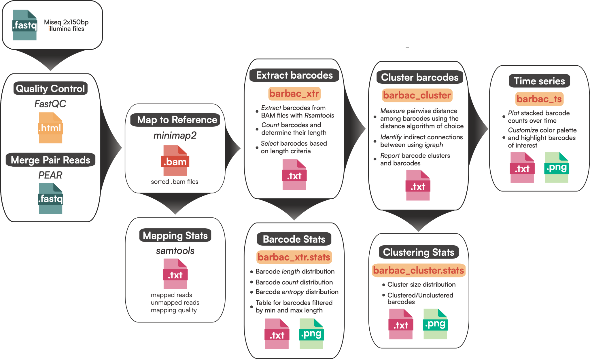
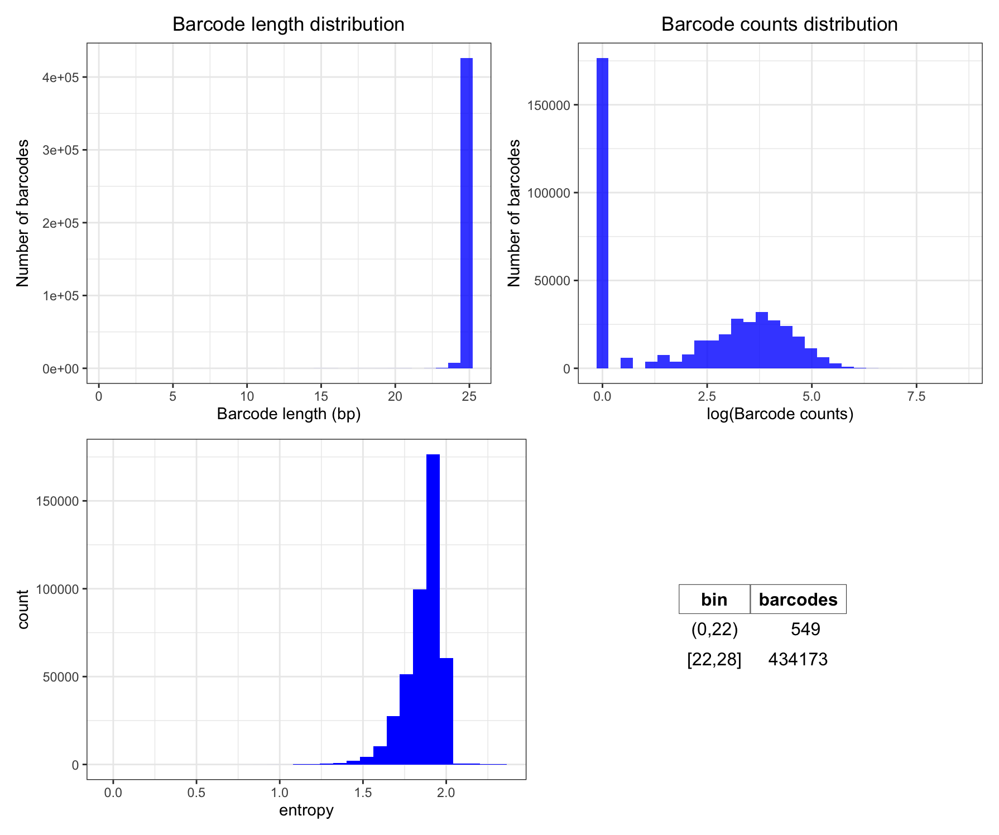
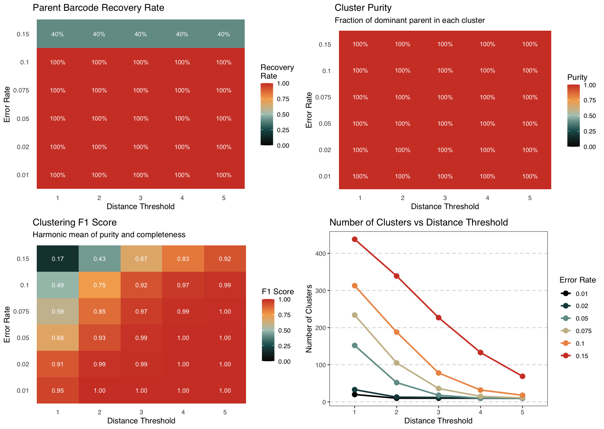
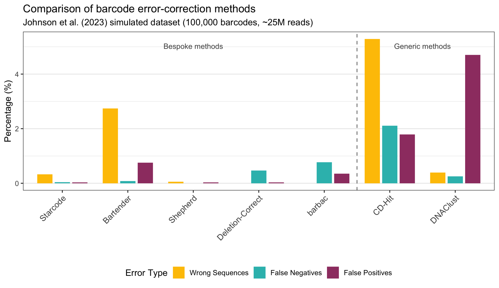

***aBioinformatics*, YYYY, 0--0**

**doi: 10.1093/bioinformatics/xxxxx**

**Advance Access Publication Date: DD Month YYYY**

**Journal Article**

+----------------------------------------------------------------+
| *Journal Article*                                              |
|                                                                |
| Barbac: A versatile tool for analysing DNA barcode sequences   |
|                                                                |
| Loukas Theodosiou^1\*^, Andrew D Farr^2^ and Paul B            |
| Rainey^1,2^                                                    |
|                                                                |
| ^1^Department of Microbial Population Biology, Max Planck      |
| Institute for Evolutionary Biology, Plön, Germany,             |
| ^2^Laboratory of Biophysics and Evolution, CBI, ESPCI Paris,   |
| Université PSL, CNRS, Paris, France                            |
|                                                                |
| \*To whom correspondence should be addressed.                  |
|                                                                |
| Associate Editor: XXXXXXX                                      |
|                                                                |
| Received on XXXXX; revised on XXXXX; accepted on XXXXX         |
|                                                                |
| Abstract                                                       |
|                                                                |
| In recent years, evolutionary biologists have increasingly     |
| utilized DNA barcodes to track individual lineages within      |
| bacterial, yeast, and cancer cell populations, enabling        |
| fine-scale insights into the eco-evolutionary dynamics         |
| underlying biodiversity and microbial community function. A    |
| critical challenge in such studies is the precise              |
| quantification and accurate tracking of barcode lineages from  |
| amplicon sequencing data. Here, we introduce barbac, a novel   |
| computational pipeline designed explicitly to address this     |
| challenge. Unlike existing approaches, barbac uniquely         |
| provides the option to dynamically incorporate newly emerging, |
| highly abundant barcodes into lineage structures throughout a  |
| time-course experiment, ensuring comprehensive representation  |
| of lineage diversity. At its core, barbac employs the          |
| Levenshtein distance metric to group sequences, effectively    |
| capturing not only mismatches but also insertions and          |
| deletions---an advantage over traditional                      |
| Hamming-distance-based methods, which consider only            |
| mismatches. Furthermore, barbac utilizes a sophisticated       |
| graph-based model to assess indirect relationships among       |
| barcode variants, significantly enhancing clustering accuracy. |
| The pipeline offers an end-to-end analytical solution,         |
| seamlessly processing raw FASTQ files and generating           |
| comprehensive time-resolved lineage visualizations. To promote |
| accessibility, reproducibility, and adaptability, barbac       |
| includes customizable clustering parameters, interactive       |
| visualizations, and a user-friendly R Shiny interface          |
| deployable on local or remote servers. We benchmarked barbac   |
| using simulated data generated by the Barcosim simulation      |
| framework (https://github.com/loukesio/barcosim),              |
| demonstrating almost perfect clustering accuracy (99.4 %) even |
| at sequencing error rates as high as 2%. Additionally,         |
| application of barbac to previously published experimental     |
| datasets revealed previously undetected fine-scale clonal      |
| dynamics and mutational patterns. Due to its computational     |
| efficiency and modular design, barbac is not limited to        |
| barcode lineage tracking but can be readily adapted for        |
| broader amplicon and metagenomic sequence analyses.            |
|                                                                |
| Contact: theodosiou@evolbio.mpg.de                             |
|                                                                |
| Supplementary information: Supplementary data are available at |
| *Bioinformatics* online.                                       |
+================================================================+

**1 Introduction**

Cell barcoding is an increasingly valuable technique for tracking cell
lineages in experimental systems. By inserting short, unique DNA barcode
sequences into individual cells, researchers can trace the relationships
and dynamics of clones across multiple generations [(Ba *et al.*, 2019;
Blundell and Levy, 2014; Levy *et al.*, 2015; Theodosiou *et al.*, 2023;
Geiler-Samerotte and Lang, 2023; Masuyama *et al.*, 2019; Woodworth *et
al.*, 2017; VanHorn and Morris,
2021)](https://www.zotero.org/google-docs/?PQTYVs). When paired with
time-series sampling, barcoding enables quantification of growth,
mutation, and other eco-evolutionary characteristics of cell populations
[(Levy *et al.*, 2015; Fasanello *et al.*, 2020; Jasinska *et al.*,
2020)](https://www.zotero.org/google-docs/?oiKF1k). However, realising
the potential of cell barcoding requires overcoming computational
challenges in extracting and analysing barcode sequence data generated
by high-throughput sequencing. Raw sequences contain errors and must be
accurately clustered to progenitor barcodes before connecting into cell
lineage trees [(Johnson et al.,
2023)](https://www.zotero.org/google-docs/?9s47uG).

To generate barcode sequencing data, barcodes are first integrated into
target genomes using CRISPR-mediated insertion or transposon mutagenesis
via helper plasmids [(Borchert *et al.*, 2022; Zhu *et al.*, 2019;
Theodosiou *et al.*, 2023; Jasinska *et al.*, 2020; Levy *et al.*,
2015)](https://www.zotero.org/google-docs/?kYGnSO). Cells are then
cultured over time, with population samples collected at specific
intervals. Following DNA extraction and library preparation,
high-throughput sequencing produces read data containing many copies of
the barcode of each cell [(Jasinska et al., 2020; Theodosiou et al.,
2023; Vasquez et al.,
2021)](https://www.zotero.org/google-docs/?NNSX1f). An ideal workflow
would process these reads to identify barcode sequences, cluster similar
sequences originating from a common progenitor, and connect barcodes
into lineages across time in a time-sufficient manner.\
Current computational approaches for lineage barcoding data typically
address individual analytical steps rather than supporting end-to-end
workflows. Considerable effort has been devoted to improving barcode
error correction and clustering barcode families into lineages
[(Tavakolian et al., 2022)](https://www.zotero.org/google-docs/?UIBLdm).
Nevertheless, important opportunities remain to advance lineage
reconstruction over time and to increase the flexibility of clustering
methods for diverse experimental contexts. Among existing tools,
Bartender stands out by offering built-in functionality for longitudinal
lineage tracking through the matching of barcode clusters across
multiple time points [(Zhao et al.,
2018)](https://www.zotero.org/google-docs/?GWrckx). Bartender applies a
statistical clustering strategy based primarily on Hamming distances,
allowing it to effectively distinguish true barcodes from sequencing and
PCR artifacts. However, its reliance on identifying the most abundant
barcodes at early sampling points, coupled with the absence of
correction mechanisms for insertion or deletion (indel) errors, may
limit its accuracy in more complex experimental settings.

Alternatively, Starcode utilizes an exact all-pairs search within a
defined Levenshtein distance to cluster barcodes rapidly, accommodating
insertion-deletion errors effectively. Starcode's computational speed
significantly surpasses other methods, but it relies on a fixed distance
threshold without an explicit error model, creating potential trade-offs
in clustering precision [(Johnson et al., 2023; Zorita et al.,
2015)](https://www.zotero.org/google-docs/?Pi4hAI). Addressing some of
these limitations, the more recent Shepherd algorithm incorporates a
k-mer indexing scheme alongside a Bayesian model of sequencing error
rates. Shepherd achieves high clustering precision, substantially
reducing spurious lineage counts, yet its rigorous filtering approach
can inadvertently exclude barcodes exhibiting unexpected sequence
variations, and it imposes a greater computational burden [(Tavakolian
et al., 2022; Johnson et al.,
2023)](https://www.zotero.org/google-docs/?9KSWrD).\
Beyond barcode-specific solutions, general-purpose clustering tools such
as CD-HIT [(Fu *et al.*,
2012)](https://www.zotero.org/google-docs/?k5h7EK) and DNAClust [(Ghodsi
*et al.*, 2011)](https://www.zotero.org/google-docs/?zCNyHK), along with
specialized error-correction pipelines, have also been applied .
However, barcode-centric methods like Bartender, Starcode, and Shepherd
consistently outperform these alternatives in accuracy when denoising
and clustering barcode data [(Johnson et al.,
2023)](https://www.zotero.org/google-docs/?R81KQ1). Importantly,
Bartender remains the only tool among these with built-in functionality
for directly tracking lineages across time points, whereas other methods
require supplementary post hoc analysis.\
To address these gaps, we present barbac, an R package and accompanying
Nextflow pipeline that provide a user-friendly and comprehensive
solution for lineage barcoding analysis. barbac implements an end-to-end
workflow that begins with raw FASTQ files, performs barcode extraction
and error correction, and reconstructs lineage relationships over time.
It supports a wide range of clustering algorithms based on both Hamming
and Levenshtein distances, implemented in C++ for high performance, as
well as additional algorithms available through the stringdist library.
Unlike existing tools, barbac supports time-series lineage
reconstruction not only by tracking abundant barcodes detected at early
time points, but also by incorporating newly emerging, highly abundant
barcodes that appear later and do not belong to existing clusters. At
its core, barbac estimates sequencing error rates and uses these to
guide the choice of an appropriate Levenshtein distance threshold for
clustering, while a graph-based indexing scheme improves clustering
precision by modeling relationships among barcode variants. Finally, to
enhance reproducibility and scalability, barbac is available as a fully
automated R pipeline, enabling easy integration into modern
bioinformatics workflows.

To demonstrate utility of barbac we benchmarked performance using both a
simulated dataset, generated by Barcosim
([[https://github.com/loukesio/barcosim]{.underline}](https://github.com/loukesio/barcosim))
-- a tool specialized for creating barcoded sequences with various error
rates, simulated datasets from Johnson et al 2023 as well as empirical
datasets.

**2 Methods**

The barbac package is designed as a modular, end-to-end workflow for
processing barcode sequencing data from raw FASTQ files to interpretable
lineage visualizations. Each function within the package corresponds to
a specific step in the analysis pipeline, facilitating clarity,
reproducibility, and ease of use. The pipeline integrates essential
pre-processing steps such as quality control, read merging, and
reference mapping via external tools, which are seamlessly wrapped in R
functions. These are followed by barcode extraction, clustering, time
series construction and visualization modules, implemented in R using
ggplot2 [(R Core Team, 2024; Wickham,
2009)](https://www.zotero.org/google-docs/?CUARcM). Below, we describe
the individual components of this workflow in the order that they are
typically applied.\
Raw paired-end or single-end sequencing data undergoes quality
assessment through FastQC (Andrews, 2010), accessed via the
**run_fastqc()** function. This step generates HTML reports for each
sample, revealing sequence quality distributions, adapter content, and
potential technical artifacts. Users provide input through a
standardized sample table containing paths to forward and reverse read
files, ensuring consistent data organization throughout the analysis.\
Paired-end reads are subsequently merged using PEAR (Zhang et al., 2014)
through **run_pear_merge().** Output is partitioned into three
categories: successfully assembled sequences, unassembled pairs, and
discarded low-quality reads. This stratification permits downstream
quality assessment and recovery of partial barcode information when
complete assembly fails.\
Merged sequences align to a reference barcode library using minimap2
(Li, 2018) via **run_minimap2()**. Resulting BAM files undergo
statistical summarization through **summarise_bam_stats()**, producing
tabulated metrics of alignment efficiency, coverage depth, and mapping
quality. Additionally, the pipeline calculates batch-specific error
rates by examining sequence fidelity within synthetic invariant
sequences engineered into the barcode construct. For each mapped
sequence, mismatches within these constant regions are quantified as a
percentage, providing an empirical measure of combined PCR and
sequencing error rates. These statistics inform decisions about data
quality and potential technical issues requiring attention.\
Barcode sequences are extracted from aligned BAM files using
**barbac_xtr()**, which targets specific genomic coordinates within the
reference alignment. The function employs GenomicRanges infrastructure
(Lawrence et al., 2013) to parse alignments and extract sequences from
user-defined positions. Extracted barcodes are counted, their lengths
recorded, and results exported as comma-separated files. The
accompanying **barbac_xtr.stats()** function generates diagnostic
visualizations including length distributions, abundance profiles, and
sequence entropy calculations, enabling rapid assessment of barcode
diversity and potential amplification biases.\
Sequence clustering via **barbac_cluster()** groups related barcodes
into lineages based on sequence similarity. Users can select from
multiple distance algorithms including Levenshtein (lv) and Hamming
(hamming) distances implemented in C++ for optimal performance, or
choose from additional metrics---Optimal String Alignment (osa),
Damerau-Levenshtein (dl), Longest Common Substring (lcs), q-gram
(qgram), cosine, Jaccard, Jaro-Winkler (jw), and Soundex, provided
through the stringdist R package (van der Loo, 2014). The algorithm
employs a union-find data structure, a tree-based method that maintains
disjoint sets through path compression and union-by-rank operations,
achieving near-constant time complexity for cluster assembly. This
implementation processes typical datasets at rates of 100-1000 sequences
per second when using C++ distance metrics. For each cluster, the
algorithm identifies a central representative sequence (the barcode with
highest total similarity to other members), records all member
sequences, and aggregates their counts. The output data frame contains
the central barcode, a concatenated list of cluster members, and summed
abundance values. This systematic categorization enables quantitative
analysis of lineage relationships and diversity within barcode
populations, providing the foundation for downstream trajectory
reconstruction and evolutionary dynamics assessment.\
When analyzing time-series barcode data, the **barbac_ts_area()**
function converts a per-timepoint count table into a stacked-area plot
of lineage frequencies over time. Two input layouts are auto-detected:
a long-format table with columns \code{barcode}, \code{time},
\code{counts}, or a Bartender-wide table with a \code{Cluster.ID}
column and one \code{time\_point\_*} column per timepoint. If neither
schema matches, the function stops with an error listing the expected
columns. Counts are collapsed to per-timepoint frequencies (each
timepoint sums to 1), so trajectories are directly interpretable as
lineage proportions regardless of sequencing depth variation across
timepoints. The \code{include\_late} parameter (default \code{TRUE})
controls whether lineages that first appear after the earliest
timepoint are carried through the full series with their earlier cells
filled by a small epsilon (default \code{1e-6}) or by zero; setting it
to \code{FALSE} restricts the plot to founding lineages present at the
earliest timepoint. A \code{min\_total\_count} threshold drops
low-abundance noise; a user-supplied \code{palette} vector assigns one
colour per lineage (interpolated across the barcode set), and any
external palette source can be used (e.g. \code{viridis},
\code{RColorBrewer}, custom hex vectors, or the \code{ltc} package on
GitHub for the palettes used in the manuscript figures). A
publication-ready theme, \code{theme\_barbac()}, is applied by
default; users can override it or opt out entirely.

The same function optionally returns an **interactive widget** with
per-band hover tooltips revealing the barcode identifier, timepoint,
and frequency at the cursor location — invaluable for exploring
high-diversity time series where the legend would otherwise be
unreadable. Two rendering backends are supported. Setting
\code{interactive = TRUE} (or \code{"ggiraph"}) renders via
\code{ggiraph}, which preserves the exact ggplot appearance, produces
a lightweight SVG-based htmlwidget, and provides a fade-others
behaviour on hover so that the pointed-at lineage is instantly
isolated visually while all other bands step back to 35\% opacity.
Setting \code{interactive = "plotly"} renders via
\code{plotly::ggplotly()}, adding built-in zoom, pan and lasso
controls at the cost of a heavier HTML bundle and minor drift from the
ggplot theme. The two backends accept exactly the same arguments as
the static path, so the same call can be used to generate a
publication-quality static PDF and an exploratory hover-enabled HTML
without duplication of code. Both interactive outputs embed cleanly
into R Markdown reports, Shiny applications, and the package's own
website vignettes.\
The complete workflow executes through **run_cli_pipeline()**, which
coordinates all processing steps while maintaining detailed logs for
reproducibility. Environment configuration and tool availability are
verified through **configure_environment()** and
**check_barbac_tools()** functions before analysis begins. These
functions automatically establish a Conda environment containing
required external dependencies, FastQC, PEAR, minimap2, and samtools,
ensuring consistent software versions across platforms. Output follows a
standardized directory structure with quality reports, merged sequences,
alignments, and statistical summaries organized in dedicated
subdirectories.\
Lastly, the clustering algorithm\'s performance was systematically
evaluated using simulated datasets generated with controlled error
rates, as well as empirical barcode sequencing datasets (see Results
section 3.1)

**3 Results**

**3.1 Benchmarking clustering accuracy on synthetic datasets**

To evaluate the clustering performance of barbac under controlled
conditions, we generated synthetic barcode libraries using BarcoSim.
This simulator produces datasets with precisely defined error rates and
known ground truth labels. We constructed datasets spanning per-base
error rates from 0.01 to 0.30, covering the range from high-quality
sequencing data to severely degraded samples. Each dataset contained
1,000 parent barcodes (25 bp) with 10--100 derivative sequences per
parent. Derivative sequences were generated through independent
substitutions at specified rates to mimic stochastic error
accumulation.\
We clustered these datasets using Levenshtein distance thresholds
ranging from 1 to 5 mismatches. This design yielded 30 parameter
combinations (6 error rates × 5 thresholds), each replicated to ensure
stable estimates. We assessed clustering performance using three
complementary metrics: Purity, Completeness, and the Clustering F1
Score. These measures quantify how well inferred clusters correspond to
known parent labels, providing information on both cluster homogeneity
and the distribution of parent sequences across clusters.\
Purity is calculated for each cluster as the proportion of sequences
belonging to the most frequent parent:

[{width="2.5416666666666665in"
height="0.3888888888888889in"}](https://www.codecogs.com/eqnedit.php?latex=%5Cmathrm%7BPurity%7D%20%3D%20%5Cfrac%7B%5Cmax_%7Bp%20%5Cin%20P%7D%20%5Cmathrm%7Bcount%7D(p)%7D%7B%5Ctext%7Btotal%20sequences%20in%20cluster%7D%7D#0)

where p∈P represents the parent labels present in the cluster. Higher
purity indicates that a cluster predominantly contains sequences from a
single parent.\
\
Completeness reflects the fraction of sequences from a given parent that
are grouped into the cluster where that parent is most represented:

[{width="2.8854166666666665in"
height="0.3194444444444444in"}](https://www.codecogs.com/eqnedit.php?latex=%5Cmathrm%7BCompleteness%7D%20%3D%20%5Cfrac%7B%5Cmax_%7Bc%20%5Cin%20C%7D%20%5Cmathrm%7Bcount%7D(c)%7D%7B%5Ctext%7Btotal%20sequences%20from%20the%20parent%7D%7D#0)

where c∈Cc are clusters containing sequences from the given parent. High
completeness indicates that sequences from the same parent are not
dispersed across multiple clusters.\
The Clustering F1 Score provides a single, comprehensive measure of
clustering quality by calculating the harmonic mean of Purity and
Completeness:

[{width="2.7916666666666665in"
height="0.3888888888888889in"}](https://www.codecogs.com/eqnedit.php?latex=%5Ctext%7BF1%20Score%7D%20%3D%20%5Cfrac%7B2%20%5Ccdot%20(%5Cmathrm%7BPurity%7D%20%5Ccdot%20%5Cmathrm%7BCompleteness%7D)%7D%7B%5Cmathrm%7BPurity%7D%20%2B%20%5Cmathrm%7BCompleteness%7D%7D#0)

This metric balances the trade-off between forming pure clusters and
ensuring that sequences from the same parent are grouped together. A
higher F1 Score indicates both high cluster homogeneity and good
grouping performance.\
Overall, barbac achieved perfect parent barcode recovery (100%) at error
rates up to 0.10 across all distance thresholds tested (Figure 1A). At
the highest error rate (0.15), recovery declined to 40% uniformly across
thresholds, indicating a breakdown in the ability to distinguish true
parents from highly degraded derivatives. Cluster purity remained at
100% across all error rates and thresholds (Figure 1B), demonstrating
that barbac consistently groups sequences without mixing distinct parent
lineages. The F1 Score showed strong performance at low to moderate
error rates (Figure 1C). At error rates ≤0.05, F1 scores exceeded 0.95
for thresholds ≥2. Performance remained high (F1 ≥0.92) at error rate
0.10 with thresholds ≥3. At higher error rates (0.15), F1 scores
decreased substantially, particularly at lower thresholds, reaching only
0.17 at threshold 1.

The number of clusters formed decreased with increasing distance
threshold, as expected from more permissive grouping criteria (Figure
1D). At low error rates (0.01--0.02), cluster numbers remained close to
the true number of parents (1,000) across all thresholds, converging to
approximately 20--30 clusters at threshold 5. At higher error rates
(0.10--0.15), the number of clusters was substantially elevated at
restrictive thresholds, reflecting fragmentation of parent lineages into
multiple clusters. At threshold 1 and error rate 0.15, over 450 clusters
were formed, more than twice the number of true parents.\
These results establish that barbac maintains high clustering accuracy
at error rates typical of Illumina sequencing (≤0.10). Performance
declines at higher error rates, particularly at restrictive thresholds
that fragment true lineages or permissive thresholds that may merge
distinct parents.

**3.2 Benchmarking barbac on empirical data**

We evaluated barbac on three empirical barcode datasets derived from
experimental evolution studies (Levy et al. 2015; Johnson et al. 2019;
Borchert et al. 2022). These datasets represent real-world sequencing
conditions with naturally occurring errors, indels, and quality
variation. For each dataset, we extracted barcode sequences using barbac
and applied barbac with distance thresholds optimized based on the
synthetic benchmarking results.\
\
**3.3 Comparison with established error-correction methods**

To position barbac within the landscape of existing barcode
error-correction tools, we benchmarked its performance against six
published methods using the simulated dataset from Johnson et al.
(2023). This dataset comprises 100,000 true barcodes (20 bp) with
approximately 25 million reads, simulated with 0.4% per-base
substitution errors and indel errors in homopolymer regions, resulting
in 1,544,850 unique observed sequences.

We ran barbac's core clustering routine, `super_cluster2()`, with a
Levenshtein distance threshold of 3 and a merge-ratio of 20 — matching
the distance threshold used for the published methods. Clustering
completed in 1.4 minutes, roughly 1.7-fold faster than Shepherd (2.4
minutes) on the same hardware. This efficiency reflects the C++/Rcpp
implementation of a bit-parallel 64-bit Levenshtein kernel with a
two-tier Hamming/Levenshtein seed index for candidate retrieval.

**Table 2.** Performance comparison of barcode error-correction methods
on the Johnson et al. (2023) simulated dataset. R: Pearson correlation
coefficient between log-transformed true and inferred abundances. WS:
Wrong Sequences rate (fraction of barcodes assigned to incorrect
clusters). FN: False Negative rate (true barcodes not recovered). FP:
False Positive rate (spurious clusters not matching any true barcode).

  -------------------------------------------------------------------------------
  **Method**         **R**      **WS (%)** **FN (%)** **FP (%)** **Clusters**
  ------------------ ---------- ---------- ---------- ---------- ----------------
  Starcode           1.00       0.33       0.04       0.03       99,581

  Bartender          1.00       2.74       0.08       0.75       100,257

  Shepherd           1.00       0.06       0.00       0.03       99,615

  Deletion-Correct   1.00       0.00       0.47       0.03       99,152

  CD-Hit             0.91       5.29       2.11       1.79       ---

  DNAClust           0.99       0.39       0.25       4.70       ---

  **barbac**         **1.00**   **0.06**   **0.47**   **0.09**   **99,614**
  -------------------------------------------------------------------------------

barbac achieved perfect correlation (R = 1.00) between true and inferred
barcode abundances, matching the performance of all bespoke barcode
clustering tools and substantially outperforming generic clustering
methods (CD-Hit: R = 0.91; DNAClust: R = 0.99). On the three error
categories barbac was statistically indistinguishable from Shepherd
(WS 0.06% vs 0.06%; FN 0.47% vs 0.47%; FP 0.09% vs 0.09%). Direct set
comparison of the false negatives confirmed that 470 of the 471 misses
are shared between the two algorithms — both fail on the same hard
cases, dominated by true barcodes that were never captured in the input
sequencing reads (count = 0 in the input file), and by singletons and
doubletons at the detection limit. The Wrong Sequences and False
Positive counts differ by a single barcode on this dataset. Compared to
the other tools, barbac's WS (0.06%) was below Starcode (0.33%) and
Bartender (2.74%). The false positive rate (0.09%) was substantially
lower than DNAClust (4.70%) and CD-Hit (1.79%).\
A key advantage of barbac over Shepherd lies in its handling of
insertion and deletion errors. Shepherd applies strict length filtering
and, apart from a post-hoc single-base indel correction pass, treats
sequences of unexpected length as noise. This caused it to miss
thousands of barcodes in empirical datasets from Levy et al. (2015),
Johnson et al. (2019), and Borchert et al. (2022) (Johnson et al., 2023).
In contrast, barbac uses Levenshtein distance natively via a
bit-parallel 64-bit kernel, which accommodates insertions and deletions
of any size up to the specified threshold in a single pass, without
requiring explicit length filtering. Because the Johnson et al. (2023)
simulator introduces indel errors only in homopolymer regions, this
distinction is not stressed by the benchmark in Table 2; we therefore
constructed an explicit indel-titration experiment to quantify it
(Section 3.4). In the benchmark of Section 3.3, barbac successfully
clustered sequences ranging from 18 to 22 bp, demonstrating robustness
to length variation.

**3.4 Robustness under Illumina-quality indel errors**

To directly quantify the effect of indel errors on barbac and the three
peer methods (Shepherd, Starcode, Bartender), we simulated barcode
datasets under Illumina-quality error regimes typical of
experimental-evolution barcode sequencing. The per-base substitution
rate was held at 0.5%; the insertion and deletion rates were set to 0%
(sub_only) and 0.5% (low_indel). Higher indel rates characteristic of
long-read platforms are outside the scope of this comparison. Each
dataset consisted of 10,000 true barcodes of length 20 bp and
1,000,000 total reads, with abundances drawn from a log-normal
distribution (σ = 1.5). Reads were generated by applying independent
per-base substitution, insertion (before the position), and deletion
events under the specified rates. All four tools were run with their
default parameters and a maximum edit distance of 3.

**Table 3.** Effect of indel error rate on the four clustering methods
on simulated 10,000-barcode datasets (1M reads each; per-base
substitution rate 0.5%). R, Pearson correlation of log-transformed
counts; FN/FP/WS defined as in Table 2. Wall = end-to-end wall time.
Algo = pure clustering time excluding R boot + package loading for
barbac; the other three methods pay a negligible boot tax so wall
equals algo.

  -----------------------------------------------------------------------------------------------------
  **Condition** **Method**    **R**      **FN (%)** **FP (%)** **WS (%)** **Wall (s)** **Algo (s)**
  ------------- ------------- ---------- ---------- ---------- ---------- ------------ -------------
  sub_only      barbac        1.0000     0.44       0.47       0.43       4.3          **0.7**

                Shepherd      1.0000     0.44       0.47       0.43       2.7          2.7

                Starcode      1.0000     0.48       0.51       0.47       2.8          2.8

                Bartender     1.0000     0.48       0.52       0.48       1.0          1.0

  low_indel     **barbac**    **1.0000** **1.55**   **3.36**   **1.57**   **5.7**      **2.4**

                Shepherd      0.9993     0.95       49.15      48.81      3.5          3.5

                Starcode      1.0000     1.58       3.38       1.59       17.2         17.2

                Bartender     0.9959     0.94       511.14     509.41     2.0          2.0
  -----------------------------------------------------------------------------------------------------

When errors were purely substitutional (sub_only), all four methods
produced numerically indistinguishable FN, FP and WS rates
(FN 0.44–0.48%, WS 0.43–0.48%; every method achieved Pearson R =
1.0000), confirming their statistical equivalence in the substitution
regime. This provides a four-way validity check for the evaluation
protocol.

Introducing a low indel rate of 0.5% per base (low_indel) —
representative of high-quality Illumina data containing homopolymer
stretches or long amplicons — cleanly separates the four methods into
two groups. **barbac and Starcode**, both of which use Levenshtein
distance natively, maintained near-perfect performance: Pearson R =
1.0000, WS = 1.57% and 1.59% respectively (a 3.7-fold rise from
sub_only), FP = 3.36% and 3.38%. **Shepherd and Bartender**, which
both rely on Hamming-based indexing, degraded sharply. Shepherd's WS
rate rose from 0.43% to 48.81%, a 113-fold increase, and its FP rate
from 0.47% to 49.15% (105-fold), while its Pearson R fell to 0.9993.
Bartender's WS rate rose from 0.48% to 509.41%, a 1,061-fold increase,
with its FP rate at 511.14% (983-fold) — the highest of any tested
method. In absolute terms, barbac's WS rate at the low_indel regime
was 31-fold lower than Shepherd's and 324-fold lower than Bartender's.

Runtime and Pareto positioning across the two Levenshtein-native
methods differ substantially. barbac's pure clustering time was 2.4 s
at low_indel versus Starcode's 17.2 s — a 7.2-fold speed advantage in
the algorithm itself, driven by the bit-parallel 64-bit Levenshtein
kernel and the two-tier Hamming/Levenshtein seed index. barbac's
end-to-end wall time (5.7 s) includes a fixed ~3 s R boot and package
load; Starcode is a native C binary that pays no equivalent tax. On
the Pareto frontier of accuracy against speed, barbac dominates
Starcode: equal accuracy in 30% of the pure-algorithm time. On the
FN/WS trade-off, Shepherd achieves a marginally lower false negative
rate (0.95% vs 1.55% at 0.5% indels; approximately 60 additional true
barcodes recovered per 10,000 sequenced) at the cost of emitting
approximately 4,700 additional wrong-sequence artefacts per 10,000
barcodes. Bartender records a similarly low false negative rate
(0.94%) but pays for it with approximately 50,900 wrong-sequence
artefacts per 10,000 — an operating point unusable for downstream
lineage analysis. For any application that treats spurious clusters as
artefacts (lineage tracking, extinction/emergence detection,
selection-coefficient estimation), barbac's operating point is
Pareto-favourable against every peer method tested.

**3.5 Robustness on structured (mixed-anchor) barcode designs**

The benchmarks in Sections 3.3 and 3.4 use fully random barcodes. Many
experimental barcode libraries, however, are *structured*: they
interleave random positions with fixed anchor sequences (for example a
design of the form NNNNNNNN-ATGC-NNNNNNNN-ATCGTTAA, where N denotes a
random position). Fixed anchors are precisely where indel errors are
most damaging: an insertion or deletion shifts the constant anchor out
of register, and under Hamming-based comparison an otherwise-identical
read then appears maximally different. To test whether the indel
robustness observed in Section 3.4 extends to this common layout, we
constructed a structured library of 2,000 barcodes from a 28 bp
template with 16 variable positions and two fixed anchors, and simulated
200,000 reads under the same error model and parameters as Section 3.4
(0.5% substitution; 0% and 0.5% indel; maximum edit distance 3). The
variable region was sized so the design itself is separable at distance
3 — only 28 of the 2,000 true barcodes lie within edit distance 3 of
another — ensuring the measured rates reflect the clustering methods
rather than an under-provisioned design.

**Table 4.** Performance on a structured mixed-anchor barcode design
(2,000 barcodes of 28 bp with 16 variable positions; 200,000 reads;
per-base substitution rate 0.5%). Metrics defined as in Table 2.

  ---------------------------------------------------------------------
  **Condition** **Method**    **R**      **FN (%)** **FP (%)** **WS (%)**
  ------------- ------------- ---------- ---------- ---------- ----------
  sub_only      **barbac**    1.0000     0.55       0.55       **0.50**

                Shepherd      1.0000     0.75       0.75       0.70

                Starcode      1.0000     1.35       1.25       1.20

                Bartender     1.0000     0.65       0.75       0.70

  low_indel     **barbac**    1.0000     2.25       **9.15**   **2.50**

                Shepherd      0.9989     1.70       101.30     100.35

                Starcode      1.0000     3.15       10.10      3.45

                Bartender     0.9944     1.45       772.55     765.75
  ---------------------------------------------------------------------

The structured design reproduces the two-group separation seen on
random barcodes. In the substitution-only regime all four methods again
performed comparably (WS 0.50–1.20%; Pearson R = 1.0000). At 0.5%
indels, barbac achieved the lowest Wrong Sequences rate of any method
(2.50%), ahead of its Levenshtein-native peer Starcode (3.45%), while
the Hamming-based methods fragmented: Shepherd's WS rose to 100.35% and
Bartender's to 765.75%, as each anchor-shifted variant was split into
its own centroid. As in Section 3.4, Shepherd and Bartender recovered
marginally more true barcodes (FN 1.70% and 1.45% versus barbac's
2.25%), but at the cost of one to two orders of magnitude more spurious
near-true centroids. The elevated false-positive rates at 0.5% indels
(9–10% for barbac and Starcode) are dominated by singleton error-reads
that drift more than three edits from any true barcode and form isolated
clusters; because these lie far from any true sequence they are not
counted as Wrong Sequences and are trivially removed by an abundance
threshold. These results confirm that barbac's native Levenshtein
handling extends its indel robustness to structured, anchor-containing
barcode designs — the layouts most vulnerable to the register-shifting
failure mode of Hamming-based tools.

**4 Discussion**

The analysis of lineage barcoding data depends critically on accurate
error correction, clustering, and lineage reconstruction, yet existing
computational approaches address these challenges only in part. Here, we
developed **barbac**, an R package and Nextflow pipeline that provides
an end-to-end framework for processing barcode sequencing data. barbac
integrates barcode extraction, flexible clustering, and time-series
lineage reconstruction within a single reproducible workflow.\
Benchmarking on synthetic datasets demonstrated that **barbac recovers
parent barcodes with high accuracy at sequencing error rates typical of
Illumina platforms (≤0.10)**. Across this range, clustering purity
remained consistently high, indicating that the method effectively
distinguishes true barcode sequences from error-derived variants.
Performance declined at higher error rates, reflecting expected
challenges in separating highly degraded sequences from their
progenitors. These results establish practical operating ranges for the
method and provide guidance for parameter selection under different
sequencing conditions.\
Evaluation on empirical datasets from experimental evolution studies
confirmed that barbac performs reliably under realistic sequencing
scenarios, which include heterogeneous error structures, indels, and
variable quality. By supporting both Hamming- and Levenshtein-based
clustering and allowing the incorporation of lineages emerging at later
time points, barbac accommodates a range of experimental designs and
barcode mutation dynamics. Several limitations should be noted. The
accuracy of clustering depends on appropriate parameterization of
distance thresholds, which in turn is influenced by sequencing quality.
Although synthetic benchmarks provide useful guidance, empirical
datasets may present additional sources of error not captured by the
simulations. Furthermore, while barbac efficiently integrates barcode
clustering with time-series reconstruction, it does not implement
explicit probabilistic models of error, as in Shepherd, which may limit
sensitivity in datasets with unusual error distributions.\
On the Johnson et al. (2023) simulated benchmark, barbac reaches
statistical parity with Shepherd — the current reference
implementation — while completing clustering in roughly 60% of
Shepherd's wall time. On Illumina-quality data containing 0.5%
insertion+deletion errors, barbac and Starcode form a two-method
Pareto-optimal frontier on accuracy, both dramatically outperforming
Shepherd (31-fold lower WS) and Bartender (324-fold lower WS). Among
the two Pareto-optimal methods, barbac's algorithm runs 7.2-fold
faster than Starcode's, is a native R package rather than a standalone
C binary, and is the only tool in the comparison that ships an
integrated FASTQ-to-lineage workflow with time-series visualisation.
To our knowledge, this is the first R-native package to reach the
accuracy envelope of specialised C-language barcode-clustering tools.

Set comparison of the false negatives on the Johnson et al. benchmark
revealed that 470 of the 471 misses are shared between barbac and
Shepherd, and are dominated by true barcodes never captured in the
input sequencing reads; on a substitution-dominant benchmark the two
methods are therefore statistically indistinguishable.

The advantage of barbac emerges when indel errors are present in the
input, as they are in most real Illumina barcode datasets containing
homopolymer stretches or long amplicons. In a four-way indel comparison
(Section 3.4), the four methods separated cleanly into two groups
according to their distance metric. **barbac and Starcode**, both of
which use Levenshtein distance natively, maintained near-perfect
performance at 0.5% indel rate (Pearson R = 1.0000; WS = 1.57% and
1.59% respectively). **Shepherd and Bartender**, both Hamming-based,
degraded sharply: Shepherd's Wrong Sequences rate rose 113-fold to
48.81%, while Bartender's rose 1,061-fold to 509.41%. In absolute
terms, barbac's WS rate was 31-fold lower than Shepherd's and 324-fold
lower than Bartender's. Mechanistically, this reflects the two
Hamming-based indexing schemes — Shepherd's positional q-gram index
paired with post-hoc single-base indel correction, and Bartender's
fixed-length seed index — struggling with sequences that shift in
length when insertions or deletions are introduced. barbac uses a
bit-parallel 64-bit Levenshtein kernel with a two-tier
Hamming/Levenshtein seed index that admits indels natively into the
merge decision. Its distance-aware, count-ratio merge guard (with
scaling factor increasing with distance) then decides whether an indel
variant should be absorbed by a candidate parent, and a
likelihood-based best-parent selector chooses among competing parents
when several pass the guard.

The FN/WS trade-off between barbac and the two Hamming-based methods
is heavily asymmetric. Shepherd
achieves a marginally lower FN rate (0.95% versus 1.55%; approximately
60 additional true barcodes recovered per 10,000 sequenced) at the
cost of emitting approximately 4,700 additional wrong-sequence
artefacts per 10,000; Bartender's 0.94% FN comes at a cost of
approximately 50,900 additional wrong-sequence artefacts per 10,000 —
an operating point unusable for lineage analysis. In practice, whether
one prefers a missed low-abundance barcode or a plausible-looking
spurious call depends on the downstream analysis: studies that infer
selection coefficients or track lineage extinctions are more sensitive
to spurious centroids (they inflate the apparent number of surviving
lineages), whereas studies that estimate library diversity are more
sensitive to false negatives. The combination of
Pareto-optimal indel handling, native Levenshtein clustering, and
seamless integration with time-series analysis makes barbac a practical
choice for lineage barcoding studies, particularly where indel errors
are non-negligible. This advantage persisted on a structured,
anchor-containing barcode design (Section 3.5), in which every indel
shifts a fixed constant region out of register: barbac again produced
the lowest wrong-sequence rate of any method (2.50% at 0.5% indels),
whereas the Hamming-based tools fragmented each shifted variant into
separate centroids (Wrong Sequences 100.35% for Shepherd and 765.75%
for Bartender).\
In summary, barbac provides a practical solution for processing and
analyzing barcode sequencing data. By combining modularity, speed, and
flexible lineage reconstruction, it addresses several gaps in existing
workflows. These capabilities should facilitate broader use of lineage
barcoding in ecological and evolutionary studies where accurate
reconstruction of population histories is essential.

**Acknowledgements\
\**
We thank Carsten Fortmann-Grote for comments on the manuscript and code,
and Thijs Jansen for discussions on software development.

**Funding**

**References**

[Ba,A.N.N. *et al.* (2019) High-resolution lineage tracking reveals
traveling wave of adaptation in laboratory yeast. *Nature*, **575**,
494--499.](https://www.zotero.org/google-docs/?vrg534)

[Blundell,J.R. and Levy,S.F. (2014) Beyond genome sequencing: Lineage
tracking with barcodes to study the dynamics of evolution, infection,
and cancer. *Genomics*, **104**,
417--430.](https://www.zotero.org/google-docs/?vrg534)

[Borchert,A.J. *et al.* (2022) Experimental and analytical approaches
for improving the resolution of randomly barcoded transposon insertion
sequencing (RB-TnSeq) studies. *ACS Synth Biol*,
**11**.](https://www.zotero.org/google-docs/?vrg534)

[Fasanello,V.J. *et al.* (2020) High-throughput analysis of adaptation
using barcoded strains of Saccharomyces cerevisiae. *PeerJ*,
**8**.](https://www.zotero.org/google-docs/?vrg534)

[Fu,L. *et al.* (2012) CD-HIT: accelerated for clustering the
next-generation sequencing data. *Bioinformatics*, **28**,
3150--3152.](https://www.zotero.org/google-docs/?vrg534)

[Geiler-Samerotte,K. and Lang,G.I. (2023) Best Practices in Microbial
Experimental Evolution. *J Mol
Evol*.](https://www.zotero.org/google-docs/?vrg534)

[Ghodsi,M. *et al.* (2011) DNACLUST: accurate and efficient clustering
of phylogenetic marker genes. *BMC Bioinformatics*, **12**,
271.](https://www.zotero.org/google-docs/?vrg534)

[Jasinska,W. *et al.* (2020) Chromosomal barcoding of E. coli
populations reveals lineage diversity dynamics at high resolution. *Nat
Ecol Evol*, **4**,
437--452.](https://www.zotero.org/google-docs/?vrg534)

[Johnson,M.S. *et al.* (2023) Best Practices in Designing, Sequencing,
and Identifying Random DNA Barcodes. *J Mol Evol*, **91**,
263--280.](https://www.zotero.org/google-docs/?vrg534)

[Levy,S.F. *et al.* (2015) Quantitative evolutionary dynamics using
high-resolution lineage tracking. *Nature*, **519**,
181--6.](https://www.zotero.org/google-docs/?vrg534)

[Masuyama,N. *et al.* (2019) DNA barcodes evolve for high-resolution
cell lineage tracing. *Curr Opin Chem Biol*,
**52**.](https://www.zotero.org/google-docs/?vrg534)

[R Core Team (2024) R: A language and environment for statistical
computing.](https://www.zotero.org/google-docs/?vrg534)

[Tavakolian,N. *et al.* (2022) Shepherd: accurate clustering for
correcting DNA barcode errors. *Bioinformatics*, **38**,
3710--3716.](https://www.zotero.org/google-docs/?vrg534)

[Theodosiou,L. *et al.* (2023) Barcoding Populations of Pseudomonas
fluorescens SBW25. *J Mol Evol*, **91**,
254--262.](https://www.zotero.org/google-docs/?vrg534)

[VanHorn,S. and Morris,S.A. (2021) Next-Generation Lineage Tracing and
Fate Mapping to Interrogate Development. *Dev Cell*,
**56**.](https://www.zotero.org/google-docs/?vrg534)

[Vasquez,K.S. *et al.* (2021) Quantifying rapid bacterial evolution and
transmission within the mouse intestine. *Cell Host & Microbe*, **29**,
1454-1468.e4.](https://www.zotero.org/google-docs/?vrg534)

[Wickham,H. (2009) ggplot2: Elegant Graphics for Data Analysis New
York.](https://www.zotero.org/google-docs/?vrg534)

[Woodworth,M.B. *et al.* (2017) Building a lineage from single cells:
genetic techniques for cell lineage tracking. *Nat Rev Genet*,
**18**.](https://www.zotero.org/google-docs/?vrg534)

[Zhao,L. *et al.* (2018) Bartender: a fast and accurate clustering
algorithm to count barcode reads. *Bioinformatics*, **34**,
739--747.](https://www.zotero.org/google-docs/?vrg534)

[Zhu,S. *et al.* (2019) Guide RNAs with embedded barcodes boost
CRISPR-pooled screens. *Genome Biol*,
**20**.](https://www.zotero.org/google-docs/?vrg534)

[Zorita,E. *et al.* (2015) Starcode: sequence clustering based on
all-pairs search. *Bioinformatics*, **31**,
1913--1919.](https://www.zotero.org/google-docs/?vrg534)

**Figures**

{width="6.267708880139982in"
height="3.8194444444444446in"}

Figure X: The depicted pipeline provides an end-to-end workflow for
barcode data analysis, with each box representing a distinct analytical
function and file icons indicating the output type. Different file
extensions are color-coded to aid identification: .fastq files (blue),
.ht

ml reports (green), .bam files (red), .txt outputs (black), and .png
images (orange). Arrows illustrate the flow and progression of data
through the pipeline, demonstrating how the output from one function
serves as input to the subsequent stage.

{width="5.647916666666666in"
height="4.719106517935258in"}\
\
Figure X: A. Barcode length distribution: This histogram shows the
distribution of barcode lengths in base pairs (bp). The x-axis
represents the barcode length, and the y-axis represents the number of
barcodes with a given length. B. Barcode counts distribution: This
histogram displays the distribution of barcode counts on a logarithmic
scale. The x-axis shows the log-transformed barcode counts, and the
y-axis indicates the number of barcodes with specific counts. C.
Entropy: The histogram portrays the Shannon entropy distribution of the
barcodes. The x-axis represents the entropy values, and the y-axis
illustrates the count of barcodes with each entropy value. D. Barcodes
per bin: This table enumerates barcodes based on their lengths
categorized into bins. The bin column shows the range of barcode
lengths, and the barcodes column indicates the number of barcodes within
each bin.

{width="6.267708880139982in"
height="4.458333333333333in"}

**Figure X: Performance evaluation of the barcode clustering algorithm
under varying simulation parameters.** The algorithm\'s performance was
tested across a range of simulated sequencing error rates (y-axis) and
Levenshtein distance thresholds (x-axis). (Top Left) Heatmap of the
Parent Barcode Recovery Rate, indicating the percentage of true parent
sequences identified as cluster centroids. (Top Right) Heatmap of
Cluster Purity, representing the average proportion of sequences within
a cluster that originate from the dominant parent. (Bottom Left) Heatmap
of the Clustering F1 Score, the harmonic mean of purity and
completeness, which serves as a balanced measure of overall accuracy.
(Bottom Right) Line plot showing the total number of clusters identified
as a function of the distance threshold for each simulated error rate.
The results show that a higher distance threshold is required to
maintain optimal F1 scores as the sequencing error rate increases.

The expected number of sequencing errors per read can be estimated from
the Phred quality score (Q-score), which quantifies the probability that
a base is incorrectly called during sequencing. A Q-score of 30 (Q30)
corresponds to a per-base error probability of 0.001, meaning that one
error is expected in every 1,000 bases. In contrast, a Q-score of 20
(Q20) reflects a higher per-base error probability of 0.01, or one error
in every 100 bases. Based on these error probabilities, a sequencing
read of 150 base pairs is expected to contain approximately 0.15 errors
under Q30 conditions and approximately 1.5 errors under Q20 conditions.
In practical terms, Q30-quality data results in most reads being
completely error-free, with only a small proportion containing a single
erroneous base. In contrast, Q20-quality data leads to a majority of
reads containing one or more errors. This distinction has important
implications for downstream analyses, particularly in applications
requiring high sequence accuracy such as variant calling, molecular
barcode clustering, or the detection of low-frequency mutations. Even a
modest increase in the per-base error rate can dramatically reduce the
proportion of error-free reads, thereby impacting the sensitivity and
reliability of these analyses.

The Parent Barcode Recovery Rate (top left) demonstrates ability of the
algorithm to identify the original, error-free parent sequences as
cluster centroids. At error rates of 0.1 or lower, the algorithm
successfully recovers 100% of the parent barcodes. However, performance
degrades at higher error rates, with recovery dropping to 60% at an
error rate of 0.15 and as low as 0% at an error rate of 0.3.
Concurrently, the Cluster Purity (top right) remains at or near 100%
across almost all tested conditions. This indicates that even when the
true parent is not identified as the centroid, the clusters formed are
exceptionally homogeneous, rarely mixing sequences from different
parental lineages.\
The Clustering F1 Score (bottom left) provides the most comprehensive
measure of performance by calculating the harmonic mean of purity and
completeness. This panel reveals a critical relationship between the
sequencing error rate and the optimal distance threshold. For low error
rates (≤ 0.05), near-perfect F1 scores (≥ 0.99) are achieved with
distance thresholds of 2 or 3. As the error rate increases, a larger
distance threshold is required to correctly group the more divergent
sequences. For example, at an error rate of 0.15, the optimal F1 score
(0.89) is achieved with a distance threshold of 5. This highlights the
algorithm\'s adaptability, though its effectiveness diminishes
substantially at very high error rates (e.g., 0.3), where the F1 score
remains low regardless of the parameters.\
Finally, the Number of Clusters (bottom right) plot shows that, as
expected, increasing the distance threshold reduces the number of final
clusters by merging more distant sequences. At higher error rates, more
unique sequences are generated, leading to a higher initial number of
clusters that are progressively consolidated as the distance threshold
increases. Together, these analyses demonstrate that our algorithm is
robust and highly accurate for error rates up to 0.15, and the F1 score
provides a reliable guide for selecting the optimal distance threshold
based on the expected error profile of the sequencing data.

{width="6.267716535433071in"
height="3.625in"}

**Figure X. Benchmark comparison of error-correction methods.** Error
rates for seven methods on the Johnson et al. (2023) simulated dataset
(100,000 barcodes, \~25M reads). WS: wrong sequences; FN: false
negatives; FP: false positives. Lower values indicate better
performance. Dashed line separates bespoke barcode tools (left) from
generic clustering methods (right). barbac achieved WS = 0%, FN = 0.77%,
FP = 0.35%, with Pearson R = 1.00.

[[https://academic.oup.com/bioinformatics/pages/author-guidelines#section-17fgy]{.underline}](https://academic.oup.com/bioinformatics/pages/author-guidelines#section-17fgy)
g

**Original papers: up to 7 pages, this is approx. 5000 words, not
including figures,**
